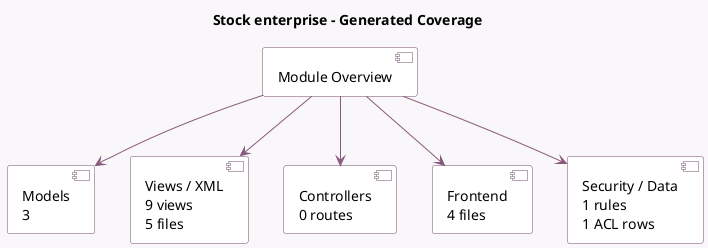

<!-- GENERATED:MODULE -->
---
tags: [odoo, enterprise, module]
---

# Stock enterprise

- Scope: Enterprise Addons
- Source: enterprise/stock_enterprise
- Dependencies: [[docs/Community Addons/stock/stock|stock]], [[docs/Enterprise Addons/web_cohort/web_cohort|web_cohort]], [[docs/Enterprise Addons/web_map/web_map|web_map]]

## Summary

Advanced features for Stock

## Generated coverage

- Models: 3
- XML files with UI/data artifacts: 5
- Views: 9
- Actions: 6
- Menus: 1
- Rules (ir.rule): 1
- Access CSV entries: 1
- Controller units: 0
- Frontend asset files: 4

## Module map

## Detail notes

- Models: [[docs/Enterprise Addons/stock_enterprise/Models|Models]] (3)
- Views and XML: [[docs/Enterprise Addons/stock_enterprise/Views|Views]] (5 files)
- Frontend: [[docs/Enterprise Addons/stock_enterprise/Frontend|Frontend]] (4 files)

## Key models

- `res.company`
- `res.config.settings`
- `stock.report`

## Navigation

- [[../Enterprise Addons/Enterprise Addons|Back to scope]]
- [[../../docs/docs|Back to docs]]

<!-- GENERATED:MODULE -->

