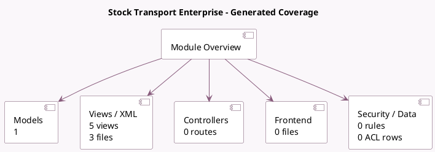

<!-- GENERATED:MODULE -->
---
tags: [odoo, enterprise, module]
---

# Stock Transport Enterprise

- Scope: Enterprise Addons
- Source: enterprise/stock_fleet_enterprise
- Dependencies: [[docs/Community Addons/stock_fleet/stock_fleet|stock_fleet]], [[docs/Enterprise Addons/web_gantt/web_gantt|web_gantt]], [[docs/Enterprise Addons/web_map/web_map|web_map]]

## Summary

Bridge module for stock_fleet and enterprise

## Generated coverage

- Models: 1
- XML files with UI/data artifacts: 3
- Views: 5
- Actions: 2
- Menus: 0
- Rules (ir.rule): 0
- Access CSV entries: 0
- Controller units: 0
- Frontend asset files: 0

## Module map

## Detail notes

- Models: [[docs/Enterprise Addons/stock_fleet_enterprise/Models|Models]] (1)
- Views and XML: [[docs/Enterprise Addons/stock_fleet_enterprise/Views|Views]] (3 files)

## Key models

- `stock.picking.batch`

## Navigation

- [[../Enterprise Addons/Enterprise Addons|Back to scope]]
- [[../../docs/docs|Back to docs]]

<!-- GENERATED:MODULE -->

