<!-- GENERATED:MODEL -->
---
tags: [odoo, enterprise, generated, model]
---

# stock.warehouse

- Module: [[docs/Enterprise Addons/stock_intrastat/stock_intrastat|stock_intrastat]]
- Scope: Enterprise Addons
- Defined in module: extension only
- Source files: `models/stock_warehouse.py`
- Python classes: `StockWarehouse`

## Field footprint

- Detected fields: 2
- Field types: `Many2one` x 2
- Relation fields: 2

## Sample fields

- `company_country_id`: `Many2one` (comodel `res.country`, related `company_id.account_fiscal_country_id`)
- `intrastat_region_id`: `Many2one` (comodel `account.intrastat.code`)

## Method hints

- Detected methods: 0
- Action methods: none
- Compute methods: none
- Onchange methods: none

## Direct relation diagram

```plantuml
@startuml
!define ODOO_COLOR_PRIMARY #714B67
!define ODOO_COLOR_ACCENT #875A7B
!define ODOO_COLOR_BG #FAF7FA

skinparam backgroundColor ODOO_COLOR_BG
skinparam defaultTextAlignment left
skinparam ArrowColor ODOO_COLOR_ACCENT
skinparam ClassBackgroundColor white
skinparam ClassBorderColor ODOO_COLOR_PRIMARY
skinparam ComponentBackgroundColor white
skinparam ComponentBorderColor ODOO_COLOR_PRIMARY
skinparam NoteBackgroundColor #FFF8FF
skinparam NoteBorderColor ODOO_COLOR_ACCENT
skinparam SequenceLifeLineBorderColor ODOO_COLOR_ACCENT
skinparam SequenceLifeLineBackgroundColor #FFFFFF
skinparam SequenceParticipantBorderColor ODOO_COLOR_PRIMARY
skinparam SequenceParticipantBackgroundColor #FFFFFF
skinparam sequence {
  ArrowColor ODOO_COLOR_ACCENT
  ActorBorderColor ODOO_COLOR_PRIMARY
}
title stock.warehouse - Direct Relations
class "stock.warehouse" as stock_warehouse
class "account.intrastat.code" as account_intrastat_code
class "res.country" as res_country
stock_warehouse --> res_country : company_country_id
stock_warehouse --> account_intrastat_code : intrastat_region_id
@enduml
```

## Navigation

- **Parent:** [[docs/Enterprise Addons/stock_intrastat/Models]]

<!-- GENERATED:MODEL -->
