<!-- GENERATED:MODEL -->
---
tags: [odoo, enterprise, generated, model]
---

# test.ai.fields.model

- Module: [[docs/Enterprise Addons/test_ai_fields/test_ai_fields|test_ai_fields]]
- Scope: Enterprise Addons
- Defined in module: yes
- Source files: `models/models.py`
- Python classes: `TestAiFields`
- Description: Test AI Fields

## Field footprint

- Detected fields: 5
- Field types: `Char` x 1, `Many2many` x 1, `Many2one` x 2, `Properties` x 1
- Relation fields: 3

## Sample fields

- `name`: `Char`
- `parent_id`: `Many2one` (comodel `test.ai.fields.parent`)
- `partner_id`: `Many2one` (comodel `res.partner`)
- `partner_ids`: `Many2many` (comodel `res.partner`)
- `properties`: `Properties`

## Method hints

- Detected methods: 1
- Action methods: none
- Compute methods: none
- Onchange methods: none

## Direct relation diagram

```plantuml
@startuml
!define ODOO_COLOR_PRIMARY #714B67
!define ODOO_COLOR_ACCENT #875A7B
!define ODOO_COLOR_BG #FAF7FA

skinparam backgroundColor ODOO_COLOR_BG
skinparam defaultTextAlignment left
skinparam ArrowColor ODOO_COLOR_ACCENT
skinparam ClassBackgroundColor white
skinparam ClassBorderColor ODOO_COLOR_PRIMARY
skinparam ComponentBackgroundColor white
skinparam ComponentBorderColor ODOO_COLOR_PRIMARY
skinparam NoteBackgroundColor #FFF8FF
skinparam NoteBorderColor ODOO_COLOR_ACCENT
skinparam SequenceLifeLineBorderColor ODOO_COLOR_ACCENT
skinparam SequenceLifeLineBackgroundColor #FFFFFF
skinparam SequenceParticipantBorderColor ODOO_COLOR_PRIMARY
skinparam SequenceParticipantBackgroundColor #FFFFFF
skinparam sequence {
  ArrowColor ODOO_COLOR_ACCENT
  ActorBorderColor ODOO_COLOR_PRIMARY
}
title test.ai.fields.model - Direct Relations
class "test.ai.fields.model" as test_ai_fields_model
class "res.partner" as res_partner
class "test.ai.fields.parent" as test_ai_fields_parent
test_ai_fields_model --> test_ai_fields_parent : parent_id
test_ai_fields_model --> res_partner : partner_id
test_ai_fields_model .. res_partner : partner_ids
@enduml
```

## Navigation

- **Parent:** [[docs/Enterprise Addons/test_ai_fields/Models]]

<!-- GENERATED:MODEL -->
