<!-- GENERATED:MODEL -->
---
tags: [odoo, enterprise, generated, model]
---

# test.ai.read.model

- Module: [[docs/Enterprise Addons/test_ai_fields/test_ai_fields|test_ai_fields]]
- Scope: Enterprise Addons
- Defined in module: yes
- Source files: `models/models.py`
- Python classes: `TestAiReadModel`
- Description: Test AI Read
- Inherits: `mail.thread`

## Field footprint

- Detected fields: 3
- Field types: `Binary` x 1, `Many2one` x 1, `Monetary` x 1
- Relation fields: 1

## Sample fields

- `currency_id`: `Many2one` (comodel `res.currency`)
- `new_binary_field`: `Binary`
- `price`: `Monetary`

## Method hints

- Detected methods: 0
- Action methods: none
- Compute methods: none
- Onchange methods: none

## Direct relation diagram

```plantuml
@startuml
!define ODOO_COLOR_PRIMARY #714B67
!define ODOO_COLOR_ACCENT #875A7B
!define ODOO_COLOR_BG #FAF7FA

skinparam backgroundColor ODOO_COLOR_BG
skinparam defaultTextAlignment left
skinparam ArrowColor ODOO_COLOR_ACCENT
skinparam ClassBackgroundColor white
skinparam ClassBorderColor ODOO_COLOR_PRIMARY
skinparam ComponentBackgroundColor white
skinparam ComponentBorderColor ODOO_COLOR_PRIMARY
skinparam NoteBackgroundColor #FFF8FF
skinparam NoteBorderColor ODOO_COLOR_ACCENT
skinparam SequenceLifeLineBorderColor ODOO_COLOR_ACCENT
skinparam SequenceLifeLineBackgroundColor #FFFFFF
skinparam SequenceParticipantBorderColor ODOO_COLOR_PRIMARY
skinparam SequenceParticipantBackgroundColor #FFFFFF
skinparam sequence {
  ArrowColor ODOO_COLOR_ACCENT
  ActorBorderColor ODOO_COLOR_PRIMARY
}
title test.ai.read.model - Direct Relations
class "test.ai.read.model" as test_ai_read_model
class "res.currency" as res_currency
test_ai_read_model --> res_currency : currency_id
@enduml
```

## Navigation

- **Parent:** [[docs/Enterprise Addons/test_ai_fields/Models]]

<!-- GENERATED:MODEL -->
