<!-- GENERATED:MODEL -->
---
tags: [odoo, enterprise, generated, model]
---

# data_cleaning.test.model

- Module: [[docs/Enterprise Addons/test_data_cleaning/test_data_cleaning|test_data_cleaning]]
- Scope: Enterprise Addons
- Defined in module: yes
- Source files: `models/data_cleaning_test_model.py`
- Python classes: `Data_CleaningTestModel`
- Description: Tests: Data Cleaning Test Model

## Field footprint

- Detected fields: 7
- Field types: `Boolean` x 1, `Char` x 3, `Many2one` x 2, `Text` x 1
- Relation fields: 2

## Sample fields

- `active`: `Boolean`
- `company_id`: `Many2one` (comodel `res.company`)
- `country_id`: `Many2one` (comodel `res.country`)
- `name`: `Char`
- `note`: `Text`
- `phone`: `Char`
- `translated_field`: `Char`

## Method hints

- Detected methods: 0
- Action methods: none
- Compute methods: none
- Onchange methods: none

## Direct relation diagram

```plantuml
@startuml
!define ODOO_COLOR_PRIMARY #714B67
!define ODOO_COLOR_ACCENT #875A7B
!define ODOO_COLOR_BG #FAF7FA

skinparam backgroundColor ODOO_COLOR_BG
skinparam defaultTextAlignment left
skinparam ArrowColor ODOO_COLOR_ACCENT
skinparam ClassBackgroundColor white
skinparam ClassBorderColor ODOO_COLOR_PRIMARY
skinparam ComponentBackgroundColor white
skinparam ComponentBorderColor ODOO_COLOR_PRIMARY
skinparam NoteBackgroundColor #FFF8FF
skinparam NoteBorderColor ODOO_COLOR_ACCENT
skinparam SequenceLifeLineBorderColor ODOO_COLOR_ACCENT
skinparam SequenceLifeLineBackgroundColor #FFFFFF
skinparam SequenceParticipantBorderColor ODOO_COLOR_PRIMARY
skinparam SequenceParticipantBackgroundColor #FFFFFF
skinparam sequence {
  ArrowColor ODOO_COLOR_ACCENT
  ActorBorderColor ODOO_COLOR_PRIMARY
}
title data_cleaning.test.model - Direct Relations
class "data_cleaning.test.model" as data_cleaning_test_model
class "res.company" as res_company
class "res.country" as res_country
data_cleaning_test_model --> res_country : country_id
data_cleaning_test_model --> res_company : company_id
@enduml
```

## Navigation

- **Parent:** [[docs/Enterprise Addons/test_data_cleaning/Models]]

<!-- GENERATED:MODEL -->
