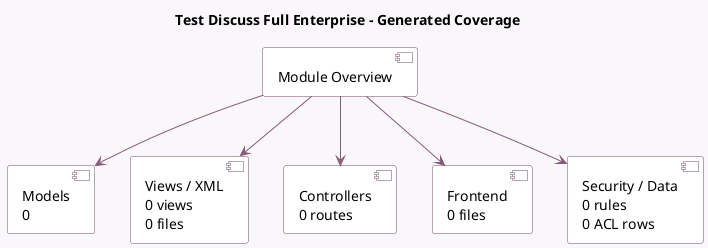

<!-- GENERATED:MODULE -->
---
tags: [odoo, enterprise, module]
---

# Test Discuss Full Enterprise

- Scope: Enterprise Addons
- Source: enterprise/test_discuss_full_enterprise
- Dependencies: [[docs/Enterprise Addons/ai/ai|ai]], [[docs/Enterprise Addons/account_accountant/account_accountant|account_accountant]], [[docs/Enterprise Addons/account_invoice_extract/account_invoice_extract|account_invoice_extract]], [[docs/Enterprise Addons/approvals/approvals|approvals]], [[docs/Enterprise Addons/documents/documents|documents]], [[docs/Enterprise Addons/knowledge/knowledge|knowledge]], [[docs/Enterprise Addons/mail_enterprise/mail_enterprise|mail_enterprise]], [[docs/Enterprise Addons/sign/sign|sign]], [[docs/Community Addons/test_discuss_full/test_discuss_full|test_discuss_full]], [[docs/Enterprise Addons/voip/voip|voip]], [[docs/Enterprise Addons/voip_ai/voip_ai|voip_ai]], [[docs/Enterprise Addons/voip_onsip/voip_onsip|voip_onsip]], [[docs/Enterprise Addons/web_enterprise/web_enterprise|web_enterprise]], [[docs/Enterprise Addons/website_helpdesk_livechat/website_helpdesk_livechat|website_helpdesk_livechat]], [[docs/Enterprise Addons/web_studio/web_studio|web_studio]], [[docs/Enterprise Addons/whatsapp/whatsapp|whatsapp]]

## Summary

Test Suite for Discuss Enterprise

## Generated coverage

- Models: 0
- XML files with UI/data artifacts: 0
- Views: 0
- Actions: 0
- Menus: 0
- Rules (ir.rule): 0
- Access CSV entries: 0
- Controller units: 0
- Frontend asset files: 0

## Module map

## Navigation

- [[../Enterprise Addons/Enterprise Addons|Back to scope]]
- [[../../docs/docs|Back to docs]]

<!-- GENERATED:MODULE -->

