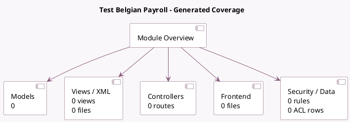

<!-- GENERATED:MODULE -->
---
tags: [odoo, enterprise, module]
---

# Test Belgian Payroll

- Scope: Enterprise Addons
- Source: enterprise/test_l10n_be_hr_payroll_account
- Dependencies: [[docs/Enterprise Addons/hr_contract_salary_payroll/hr_contract_salary_payroll|hr_contract_salary_payroll]], [[docs/Enterprise Addons/l10n_be_hr_contract_salary/l10n_be_hr_contract_salary|l10n_be_hr_contract_salary]], [[docs/Enterprise Addons/l10n_be_hr_payroll_account/l10n_be_hr_payroll_account|l10n_be_hr_payroll_account]], [[docs/Community Addons/l10n_be/l10n_be|l10n_be]], [[docs/Enterprise Addons/l10n_be_hr_payroll_sd_worx/l10n_be_hr_payroll_sd_worx|l10n_be_hr_payroll_sd_worx]], [[docs/Enterprise Addons/l10n_be_hr_payroll_group_s/l10n_be_hr_payroll_group_s|l10n_be_hr_payroll_group_s]], [[docs/Enterprise Addons/l10n_be_hr_payroll_ucm/l10n_be_hr_payroll_ucm|l10n_be_hr_payroll_ucm]], [[docs/Enterprise Addons/l10n_be_hr_payroll_partena/l10n_be_hr_payroll_partena|l10n_be_hr_payroll_partena]], [[docs/Enterprise Addons/account_accountant/account_accountant|account_accountant]], [[docs/Enterprise Addons/hr_payroll_account_iso20022/hr_payroll_account_iso20022|hr_payroll_account_iso20022]], [[docs/Enterprise Addons/documents_hr_payroll/documents_hr_payroll|documents_hr_payroll]], [[docs/Enterprise Addons/documents_hr/documents_hr|documents_hr]], [[docs/Community Addons/hr_skills/hr_skills|hr_skills]]

## Summary

Test Belgian Payroll

## Generated coverage

- Models: 0
- XML files with UI/data artifacts: 0
- Views: 0
- Actions: 0
- Menus: 0
- Rules (ir.rule): 0
- Access CSV entries: 0
- Controller units: 0
- Frontend asset files: 0

## Module map

## Navigation

- [[../Enterprise Addons/Enterprise Addons|Back to scope]]
- [[../../docs/docs|Back to docs]]

<!-- GENERATED:MODULE -->

