<!-- GENERATED:MODEL -->
---
tags: [odoo, enterprise, generated, model]
---

# mail.test.activity.bl.sms.voip

- Module: [[docs/Enterprise Addons/test_mail_enterprise/test_mail_enterprise|test_mail_enterprise]]
- Scope: Enterprise Addons
- Defined in module: yes
- Source files: `models/test_mail_models.py`
- Python classes: `MailTestActivityBlSmsVoip`
- Description: VOIP SMS Mailing Blacklist Enabled with activities
- Inherits: `mail.activity.mixin`, `mail.thread.blacklist`, `mail.thread.phone`, `voip.queue.mixin`

## Field footprint

- Detected fields: 7
- Field types: `Boolean` x 1, `Char` x 5, `Many2one` x 1
- Relation fields: 1

## Sample fields

- `customer_id`: `Many2one` (comodel `res.partner`)
- `email_from`: `Char`
- `mobile_nbr`: `Char`
- `name`: `Char`
- `opt_out`: `Boolean`
- `phone_nbr`: `Char`
- `subject`: `Char`

## Method hints

- Detected methods: 4
- Action methods: none
- Compute methods: none
- Onchange methods: none

## Direct relation diagram

```plantuml
@startuml
!define ODOO_COLOR_PRIMARY #714B67
!define ODOO_COLOR_ACCENT #875A7B
!define ODOO_COLOR_BG #FAF7FA

skinparam backgroundColor ODOO_COLOR_BG
skinparam defaultTextAlignment left
skinparam ArrowColor ODOO_COLOR_ACCENT
skinparam ClassBackgroundColor white
skinparam ClassBorderColor ODOO_COLOR_PRIMARY
skinparam ComponentBackgroundColor white
skinparam ComponentBorderColor ODOO_COLOR_PRIMARY
skinparam NoteBackgroundColor #FFF8FF
skinparam NoteBorderColor ODOO_COLOR_ACCENT
skinparam SequenceLifeLineBorderColor ODOO_COLOR_ACCENT
skinparam SequenceLifeLineBackgroundColor #FFFFFF
skinparam SequenceParticipantBorderColor ODOO_COLOR_PRIMARY
skinparam SequenceParticipantBackgroundColor #FFFFFF
skinparam sequence {
  ArrowColor ODOO_COLOR_ACCENT
  ActorBorderColor ODOO_COLOR_PRIMARY
}
title mail.test.activity.bl.sms.voip - Direct Relations
class "mail.test.activity.bl.sms.voip" as mail_test_activity_bl_sms_voip
class "res.partner" as res_partner
mail_test_activity_bl_sms_voip --> res_partner : customer_id
@enduml
```

## Navigation

- **Parent:** [[docs/Enterprise Addons/test_mail_enterprise/Models]]

<!-- GENERATED:MODEL -->
