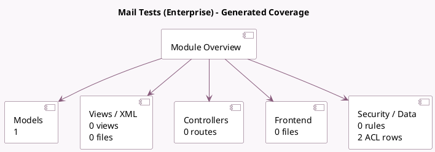

<!-- GENERATED:MODULE -->
---
tags: [odoo, enterprise, module]
---

# Mail Tests (Enterprise)

- Scope: Enterprise Addons
- Source: enterprise/test_mail_enterprise
- Dependencies: [[docs/Enterprise Addons/ai/ai|ai]], [[docs/Enterprise Addons/documents/documents|documents]], [[docs/Community Addons/mail/mail|mail]], [[docs/Community Addons/mail_bot/mail_bot|mail_bot]], [[docs/Enterprise Addons/mail_enterprise/mail_enterprise|mail_enterprise]], [[docs/Community Addons/mass_mailing/mass_mailing|mass_mailing]], [[docs/Community Addons/mass_mailing_sms/mass_mailing_sms|mass_mailing_sms]], [[docs/Enterprise Addons/marketing_automation/marketing_automation|marketing_automation]], [[docs/Enterprise Addons/marketing_automation_sms/marketing_automation_sms|marketing_automation_sms]], [[docs/Enterprise Addons/mail_mobile/mail_mobile|mail_mobile]], [[docs/Community Addons/portal/portal|portal]], [[docs/Community Addons/rating/rating|rating]], [[docs/Community Addons/snailmail/snailmail|snailmail]], [[docs/Community Addons/sms/sms|sms]], [[docs/Community Addons/test_mail/test_mail|test_mail]], [[docs/Community Addons/test_mail_full/test_mail_full|test_mail_full]], [[docs/Community Addons/test_mass_mailing/test_mass_mailing|test_mass_mailing]], [[docs/Community Addons/test_mail_sms/test_mail_sms|test_mail_sms]], [[docs/Enterprise Addons/voip/voip|voip]], [[docs/Enterprise Addons/test_whatsapp/test_whatsapp|test_whatsapp]]

## Summary

Mail Tests: performances and tests specific to mail with all sub-modules

## Generated coverage

- Models: 1
- XML files with UI/data artifacts: 0
- Views: 0
- Actions: 0
- Menus: 0
- Rules (ir.rule): 0
- Access CSV entries: 2
- Controller units: 0
- Frontend asset files: 0

## Module map

## Detail notes

- Models: [[docs/Enterprise Addons/test_mail_enterprise/Models|Models]] (1)

## Key models

- `mail.test.activity.bl.sms.voip`

## Navigation

- [[../Enterprise Addons/Enterprise Addons|Back to scope]]
- [[../../docs/docs|Back to docs]]

<!-- GENERATED:MODULE -->

