<!-- GENERATED:MODEL -->
---
tags: [odoo, enterprise, generated, model]
---

# marketing.test

- Module: [[docs/Enterprise Addons/test_marketing_automation/test_marketing_automation|test_marketing_automation]]
- Scope: Enterprise Addons
- Defined in module: yes
- Source files: `models/test_models.py`
- Python classes: `MarketingTest`
- Description: MarketAuto: simple thread-enabled model
- Inherits: `mail.thread`

## Field footprint

- Detected fields: 4
- Field types: `Char` x 2, `Many2one` x 1, `Text` x 1
- Relation fields: 1

## Sample fields

- `description`: `Text`
- `email_from`: `Char`
- `name`: `Char`
- `partner_id`: `Many2one` (comodel `res.partner`)

## Method hints

- Detected methods: 0
- Action methods: none
- Compute methods: none
- Onchange methods: none

## Direct relation diagram

```plantuml
@startuml
!define ODOO_COLOR_PRIMARY #714B67
!define ODOO_COLOR_ACCENT #875A7B
!define ODOO_COLOR_BG #FAF7FA

skinparam backgroundColor ODOO_COLOR_BG
skinparam defaultTextAlignment left
skinparam ArrowColor ODOO_COLOR_ACCENT
skinparam ClassBackgroundColor white
skinparam ClassBorderColor ODOO_COLOR_PRIMARY
skinparam ComponentBackgroundColor white
skinparam ComponentBorderColor ODOO_COLOR_PRIMARY
skinparam NoteBackgroundColor #FFF8FF
skinparam NoteBorderColor ODOO_COLOR_ACCENT
skinparam SequenceLifeLineBorderColor ODOO_COLOR_ACCENT
skinparam SequenceLifeLineBackgroundColor #FFFFFF
skinparam SequenceParticipantBorderColor ODOO_COLOR_PRIMARY
skinparam SequenceParticipantBackgroundColor #FFFFFF
skinparam sequence {
  ArrowColor ODOO_COLOR_ACCENT
  ActorBorderColor ODOO_COLOR_PRIMARY
}
title marketing.test - Direct Relations
class "marketing.test" as marketing_test
class "res.partner" as res_partner
marketing_test --> res_partner : partner_id
@enduml
```

## Navigation

- **Parent:** [[docs/Enterprise Addons/test_marketing_automation/Models]]

<!-- GENERATED:MODEL -->
