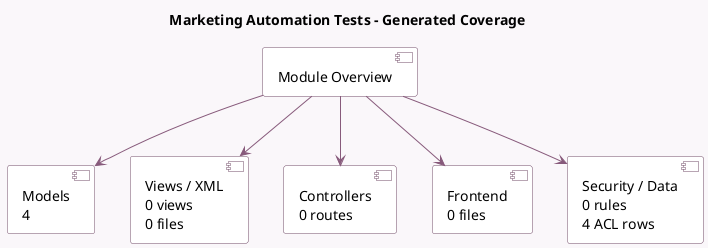

<!-- GENERATED:MODULE -->
---
tags: [odoo, enterprise, module]
---

# Marketing Automation Tests

- Scope: Enterprise Addons
- Source: enterprise/test_marketing_automation
- Dependencies: [[docs/Enterprise Addons/marketing_automation/marketing_automation|marketing_automation]], [[docs/Enterprise Addons/marketing_automation_sms/marketing_automation_sms|marketing_automation_sms]], [[docs/Enterprise Addons/marketing_automation_whatsapp/marketing_automation_whatsapp|marketing_automation_whatsapp]], [[docs/Community Addons/test_mail/test_mail|test_mail]], [[docs/Enterprise Addons/test_mail_enterprise/test_mail_enterprise|test_mail_enterprise]], [[docs/Community Addons/test_mail_full/test_mail_full|test_mail_full]], [[docs/Community Addons/test_mail_sms/test_mail_sms|test_mail_sms]], [[docs/Community Addons/test_mass_mailing/test_mass_mailing|test_mass_mailing]]

## Summary

Test Suite for Automated Marketing Campaigns

## Generated coverage

- Models: 4
- XML files with UI/data artifacts: 0
- Views: 0
- Actions: 0
- Menus: 0
- Rules (ir.rule): 0
- Access CSV entries: 4
- Controller units: 0
- Frontend asset files: 0

## Module map

## Detail notes

- Models: [[docs/Enterprise Addons/test_marketing_automation/Models|Models]] (4)

## Key models

- `marketing.test`
- `marketing.test.performance`
- `marketing.test.sms`
- `marketing.test.utm`

## Navigation

- [[../Enterprise Addons/Enterprise Addons|Back to scope]]
- [[../../docs/docs|Back to docs]]

<!-- GENERATED:MODULE -->

