<!-- GENERATED:MODEL -->
---
tags: [odoo, enterprise, generated, model]
---

# web.cohort.simple.model

- Module: [[docs/Enterprise Addons/test_web_cohort/test_web_cohort|test_web_cohort]]
- Scope: Enterprise Addons
- Defined in module: yes
- Source files: `models/test_web_cohort.py`
- Python classes: `WebCohortSimpleModel`
- Description: Simple Cohort Model

## Field footprint

- Detected fields: 7
- Field types: `Char` x 1, `Date` x 2, `Datetime` x 2, `Float` x 1, `Many2one` x 1
- Relation fields: 1

## Sample fields

- `date_start`: `Date`
- `date_stop`: `Date`
- `datetime_start`: `Datetime`
- `datetime_stop`: `Datetime`
- `name`: `Char`
- `revenue`: `Float`
- `type_id`: `Many2one` (comodel `web.cohort.type`)

## Method hints

- Detected methods: 0
- Action methods: none
- Compute methods: none
- Onchange methods: none

## Direct relation diagram

```plantuml
@startuml
!define ODOO_COLOR_PRIMARY #714B67
!define ODOO_COLOR_ACCENT #875A7B
!define ODOO_COLOR_BG #FAF7FA

skinparam backgroundColor ODOO_COLOR_BG
skinparam defaultTextAlignment left
skinparam ArrowColor ODOO_COLOR_ACCENT
skinparam ClassBackgroundColor white
skinparam ClassBorderColor ODOO_COLOR_PRIMARY
skinparam ComponentBackgroundColor white
skinparam ComponentBorderColor ODOO_COLOR_PRIMARY
skinparam NoteBackgroundColor #FFF8FF
skinparam NoteBorderColor ODOO_COLOR_ACCENT
skinparam SequenceLifeLineBorderColor ODOO_COLOR_ACCENT
skinparam SequenceLifeLineBackgroundColor #FFFFFF
skinparam SequenceParticipantBorderColor ODOO_COLOR_PRIMARY
skinparam SequenceParticipantBackgroundColor #FFFFFF
skinparam sequence {
  ArrowColor ODOO_COLOR_ACCENT
  ActorBorderColor ODOO_COLOR_PRIMARY
}
title web.cohort.simple.model - Direct Relations
class "web.cohort.simple.model" as web_cohort_simple_model
class "web.cohort.type" as web_cohort_type
web_cohort_simple_model --> web_cohort_type : type_id
@enduml
```

## Navigation

- **Parent:** [[docs/Enterprise Addons/test_web_cohort/Models]]

<!-- GENERATED:MODEL -->
