<!-- GENERATED:MODEL -->
---
tags: [odoo, enterprise, generated, model]
---

# test.web.gantt.pill

- Module: [[docs/Enterprise Addons/test_web_gantt/test_web_gantt|test_web_gantt]]
- Scope: Enterprise Addons
- Defined in module: yes
- Source files: `models/test_web_gantt_models.py`
- Python classes: `TestWebGanttPill`
- Description: Test Web Gantt Pill

## Field footprint

- Detected fields: 7
- Field types: `Boolean` x 1, `Char` x 1, `Datetime` x 2, `Many2many` x 2, `Many2one` x 1
- Relation fields: 3

## Sample fields

- `active`: `Boolean`
- `date_start`: `Datetime` (comodel `Start Datetime`)
- `date_stop`: `Datetime` (comodel `Stop Datetime`)
- `dependency_field`: `Many2many` (comodel `test.web.gantt.pill`)
- `dependency_inverted_field`: `Many2many` (comodel `test.web.gantt.pill`)
- `name`: `Char`
- `parent_id`: `Many2one` (comodel `test.web.gantt.pill`)

## Method hints

- Detected methods: 0
- Action methods: none
- Compute methods: none
- Onchange methods: none

## Direct relation diagram

```plantuml
@startuml
!define ODOO_COLOR_PRIMARY #714B67
!define ODOO_COLOR_ACCENT #875A7B
!define ODOO_COLOR_BG #FAF7FA

skinparam backgroundColor ODOO_COLOR_BG
skinparam defaultTextAlignment left
skinparam ArrowColor ODOO_COLOR_ACCENT
skinparam ClassBackgroundColor white
skinparam ClassBorderColor ODOO_COLOR_PRIMARY
skinparam ComponentBackgroundColor white
skinparam ComponentBorderColor ODOO_COLOR_PRIMARY
skinparam NoteBackgroundColor #FFF8FF
skinparam NoteBorderColor ODOO_COLOR_ACCENT
skinparam SequenceLifeLineBorderColor ODOO_COLOR_ACCENT
skinparam SequenceLifeLineBackgroundColor #FFFFFF
skinparam SequenceParticipantBorderColor ODOO_COLOR_PRIMARY
skinparam SequenceParticipantBackgroundColor #FFFFFF
skinparam sequence {
  ArrowColor ODOO_COLOR_ACCENT
  ActorBorderColor ODOO_COLOR_PRIMARY
}
title test.web.gantt.pill - Direct Relations
class "test.web.gantt.pill" as test_web_gantt_pill
class "test.web.gantt.pill" as test_web_gantt_pill
test_web_gantt_pill .. test_web_gantt_pill : dependency_field
test_web_gantt_pill .. test_web_gantt_pill : dependency_inverted_field
test_web_gantt_pill --> test_web_gantt_pill : parent_id
@enduml
```

## Navigation

- **Parent:** [[docs/Enterprise Addons/test_web_gantt/Models]]

<!-- GENERATED:MODEL -->
