<!-- GENERATED:MODEL -->
---
tags: [odoo, enterprise, generated, model]
---

# test.studio_export.model1

- Module: [[docs/Enterprise Addons/test_web_studio/test_web_studio|test_web_studio]]
- Scope: Enterprise Addons
- Defined in module: yes
- Source files: `models/test_models.py`
- Python classes: `TestStudio_ExportModel1`
- Description: Test Model for Studio Exports 1

## Field footprint

- Detected fields: 5
- Field types: `Binary` x 1, `Char` x 1, `Many2one` x 2, `One2many` x 1
- Relation fields: 3

## Sample fields

- `attachment_id`: `Many2one` (comodel `ir.attachment`)
- `attachment_ids`: `One2many` (comodel `ir.attachment`)
- `binary_data`: `Binary`
- `model2_id`: `Many2one` (comodel `test.studio_export.model2`)
- `name`: `Char`

## Method hints

- Detected methods: 0
- Action methods: none
- Compute methods: none
- Onchange methods: none

## Direct relation diagram

```plantuml
@startuml
!define ODOO_COLOR_PRIMARY #714B67
!define ODOO_COLOR_ACCENT #875A7B
!define ODOO_COLOR_BG #FAF7FA

skinparam backgroundColor ODOO_COLOR_BG
skinparam defaultTextAlignment left
skinparam ArrowColor ODOO_COLOR_ACCENT
skinparam ClassBackgroundColor white
skinparam ClassBorderColor ODOO_COLOR_PRIMARY
skinparam ComponentBackgroundColor white
skinparam ComponentBorderColor ODOO_COLOR_PRIMARY
skinparam NoteBackgroundColor #FFF8FF
skinparam NoteBorderColor ODOO_COLOR_ACCENT
skinparam SequenceLifeLineBorderColor ODOO_COLOR_ACCENT
skinparam SequenceLifeLineBackgroundColor #FFFFFF
skinparam SequenceParticipantBorderColor ODOO_COLOR_PRIMARY
skinparam SequenceParticipantBackgroundColor #FFFFFF
skinparam sequence {
  ArrowColor ODOO_COLOR_ACCENT
  ActorBorderColor ODOO_COLOR_PRIMARY
}
title test.studio_export.model1 - Direct Relations
class "test.studio_export.model1" as test_studio_export_model1
class "ir.attachment" as ir_attachment
class "test.studio_export.model2" as test_studio_export_model2
test_studio_export_model1 --> ir_attachment : attachment_id
test_studio_export_model1 --|> ir_attachment : attachment_ids
test_studio_export_model1 --> test_studio_export_model2 : model2_id
@enduml
```

## Navigation

- **Parent:** [[docs/Enterprise Addons/test_web_studio/Models]]

<!-- GENERATED:MODEL -->
