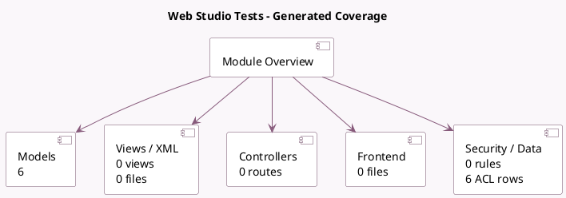

<!-- GENERATED:MODULE -->
---
tags: [odoo, enterprise, module]
---

# Web Studio Tests

- Scope: Enterprise Addons
- Source: enterprise/test_web_studio
- Dependencies: [[docs/Enterprise Addons/web_studio/web_studio|web_studio]], [[docs/Community Addons/website/website|website]], [[docs/Community Addons/sale/sale|sale]]

## Summary

Web studio Test

## Generated coverage

- Models: 6
- XML files with UI/data artifacts: 0
- Views: 0
- Actions: 0
- Menus: 0
- Rules (ir.rule): 0
- Access CSV entries: 6
- Controller units: 0
- Frontend asset files: 0

## Module map

## Detail notes

- Models: [[docs/Enterprise Addons/test_web_studio/Models|Models]] (6)

## Key models

- `test.studio.model_action`
- `test.studio.model_action2`
- `test.studio.model_action3`
- `test.studio_export.model1`
- `test.studio_export.model2`
- `test.studio_export.model3`

## Navigation

- [[../Enterprise Addons/Enterprise Addons|Back to scope]]
- [[../../docs/docs|Back to docs]]

<!-- GENERATED:MODULE -->

