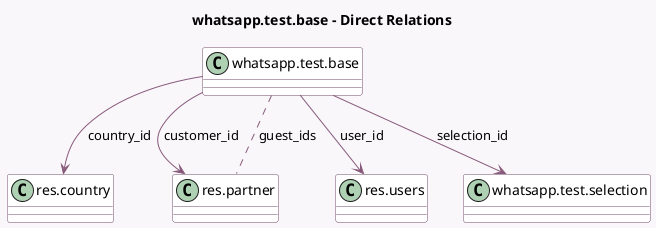

<!-- GENERATED:MODEL -->
---
tags: [odoo, enterprise, generated, model]
---

# whatsapp.test.base

- Module: [[docs/Enterprise Addons/test_whatsapp/test_whatsapp|test_whatsapp]]
- Scope: Enterprise Addons
- Defined in module: yes
- Source files: `models/test_models.py`
- Python classes: `WhatsappTestBase`
- Description: WhatsApp Base Test
- Inherits: `mail.thread`

## Field footprint

- Detected fields: 9
- Field types: `Char` x 2, `Datetime` x 1, `Many2many` x 1, `Many2one` x 4, `Selection` x 1
- Relation fields: 5

## Sample fields

- `country_id`: `Many2one` (comodel `res.country`)
- `customer_id`: `Many2one` (comodel `res.partner`)
- `datetime`: `Datetime`
- `guest_ids`: `Many2many` (comodel `res.partner`)
- `name`: `Char` (comodel `Name`)
- `phone`: `Char` (comodel `Phone`, compute `_compute_phone`, store `True`)
- `selection_field`: `Selection`
- `selection_id`: `Many2one` (comodel `whatsapp.test.selection`)
- `user_id`: `Many2one` (comodel `res.users`)

## Method hints

- Detected methods: 3
- Action methods: none
- Compute methods: `_compute_phone`
- Onchange methods: none

## Direct relation diagram

## Navigation

- **Parent:** [[docs/Enterprise Addons/test_whatsapp/Models]]

<!-- GENERATED:MODEL -->
