<!-- GENERATED:MODEL -->
---
tags: [odoo, enterprise, generated, model]
---

# whatsapp.test.nothread.noname

- Module: [[docs/Enterprise Addons/test_whatsapp/test_whatsapp|test_whatsapp]]
- Scope: Enterprise Addons
- Defined in module: yes
- Source files: `models/test_models.py`
- Python classes: `WhatsappTestNothreadNoname`
- Description: WhatsApp NoThread / NoResponsible /NoName

## Field footprint

- Detected fields: 4
- Field types: `Char` x 1, `Many2one` x 3
- Relation fields: 3

## Sample fields

- `country_id`: `Many2one` (comodel `res.country`)
- `customer_id`: `Many2one` (comodel `res.partner`)
- `phone`: `Char` (comodel `Phone`, compute `_compute_phone`, store `True`)
- `user_id`: `Many2one` (comodel `res.users`)

## Method hints

- Detected methods: 1
- Action methods: none
- Compute methods: `_compute_phone`
- Onchange methods: none

## Direct relation diagram

```plantuml
@startuml
!define ODOO_COLOR_PRIMARY #714B67
!define ODOO_COLOR_ACCENT #875A7B
!define ODOO_COLOR_BG #FAF7FA

skinparam backgroundColor ODOO_COLOR_BG
skinparam defaultTextAlignment left
skinparam ArrowColor ODOO_COLOR_ACCENT
skinparam ClassBackgroundColor white
skinparam ClassBorderColor ODOO_COLOR_PRIMARY
skinparam ComponentBackgroundColor white
skinparam ComponentBorderColor ODOO_COLOR_PRIMARY
skinparam NoteBackgroundColor #FFF8FF
skinparam NoteBorderColor ODOO_COLOR_ACCENT
skinparam SequenceLifeLineBorderColor ODOO_COLOR_ACCENT
skinparam SequenceLifeLineBackgroundColor #FFFFFF
skinparam SequenceParticipantBorderColor ODOO_COLOR_PRIMARY
skinparam SequenceParticipantBackgroundColor #FFFFFF
skinparam sequence {
  ArrowColor ODOO_COLOR_ACCENT
  ActorBorderColor ODOO_COLOR_PRIMARY
}
title whatsapp.test.nothread.noname - Direct Relations
class "whatsapp.test.nothread.noname" as whatsapp_test_nothread_noname
class "res.country" as res_country
class "res.partner" as res_partner
class "res.users" as res_users
whatsapp_test_nothread_noname --> res_country : country_id
whatsapp_test_nothread_noname --> res_partner : customer_id
whatsapp_test_nothread_noname --> res_users : user_id
@enduml
```

## Navigation

- **Parent:** [[docs/Enterprise Addons/test_whatsapp/Models]]

<!-- GENERATED:MODEL -->
