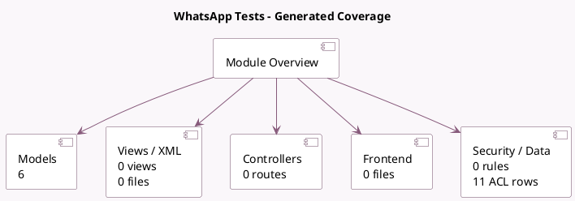

<!-- GENERATED:MODULE -->
---
tags: [odoo, enterprise, module]
---

# WhatsApp Tests

- Scope: Enterprise Addons
- Source: enterprise/test_whatsapp
- Dependencies: [[docs/Community Addons/contacts/contacts|contacts]], [[docs/Community Addons/mail/mail|mail]], [[docs/Community Addons/portal/portal|portal]], [[docs/Enterprise Addons/whatsapp/whatsapp|whatsapp]]

## Summary

WhatsApp Tests

## Generated coverage

- Models: 6
- XML files with UI/data artifacts: 0
- Views: 0
- Actions: 0
- Menus: 0
- Rules (ir.rule): 0
- Access CSV entries: 11
- Controller units: 0
- Frontend asset files: 0

## Module map

## Detail notes

- Models: [[docs/Enterprise Addons/test_whatsapp/Models|Models]] (6)

## Key models

- `whatsapp.test.base`
- `whatsapp.test.nothread`
- `whatsapp.test.nothread.noname`
- `whatsapp.test.responsible`
- `whatsapp.test.selection`
- `whatsapp.test.timezone`

## Navigation

- [[../Enterprise Addons/Enterprise Addons|Back to scope]]
- [[../../docs/docs|Back to docs]]

<!-- GENERATED:MODULE -->

