<!-- GENERATED:MODEL -->
---
tags: [odoo, enterprise, generated, model]
---

# timer.mixin

- Module: [[docs/Enterprise Addons/timer/timer|timer]]
- Scope: Enterprise Addons
- Defined in module: yes
- Source files: `models/timer_mixin.py`
- Python classes: `TimerMixin`
- Description: Timer Mixin

## Field footprint

- Detected fields: 4
- Field types: `Boolean` x 1, `Datetime` x 2, `One2many` x 1
- Relation fields: 1

## Sample fields

- `is_timer_running`: `Boolean` (related `user_timer_id.is_timer_running`)
- `timer_pause`: `Datetime` (related `user_timer_id.timer_pause`)
- `timer_start`: `Datetime` (related `user_timer_id.timer_start`)
- `user_timer_id`: `One2many` (comodel `timer.timer`, compute `_compute_user_timer_id`)

## Method hints

- Detected methods: 14
- Action methods: `action_timer_pause`, `action_timer_resume`, `action_timer_start`, `action_timer_stop`
- Compute methods: `_compute_user_timer_id`
- Onchange methods: none

## Direct relation diagram

```plantuml
@startuml
!define ODOO_COLOR_PRIMARY #714B67
!define ODOO_COLOR_ACCENT #875A7B
!define ODOO_COLOR_BG #FAF7FA

skinparam backgroundColor ODOO_COLOR_BG
skinparam defaultTextAlignment left
skinparam ArrowColor ODOO_COLOR_ACCENT
skinparam ClassBackgroundColor white
skinparam ClassBorderColor ODOO_COLOR_PRIMARY
skinparam ComponentBackgroundColor white
skinparam ComponentBorderColor ODOO_COLOR_PRIMARY
skinparam NoteBackgroundColor #FFF8FF
skinparam NoteBorderColor ODOO_COLOR_ACCENT
skinparam SequenceLifeLineBorderColor ODOO_COLOR_ACCENT
skinparam SequenceLifeLineBackgroundColor #FFFFFF
skinparam SequenceParticipantBorderColor ODOO_COLOR_PRIMARY
skinparam SequenceParticipantBackgroundColor #FFFFFF
skinparam sequence {
  ArrowColor ODOO_COLOR_ACCENT
  ActorBorderColor ODOO_COLOR_PRIMARY
}
title timer.mixin - Direct Relations
class "timer.mixin" as timer_mixin
class "timer.timer" as timer_timer
timer_mixin --|> timer_timer : user_timer_id
@enduml
```

## Navigation

- **Parent:** [[docs/Enterprise Addons/timer/Models]]

<!-- GENERATED:MODEL -->
