<!-- GENERATED:MODEL -->
---
tags: [odoo, enterprise, generated, model]
---

# timer.timer

- Module: [[docs/Enterprise Addons/timer/timer|timer]]
- Scope: Enterprise Addons
- Defined in module: yes
- Source files: `models/timer.py`
- Python classes: `TimerTimer`
- Description: Timer Module

## Field footprint

- Detected fields: 8
- Field types: `Boolean` x 1, `Char` x 2, `Datetime` x 2, `Integer` x 2, `Many2one` x 1
- Relation fields: 1

## Sample fields

- `is_timer_running`: `Boolean` (compute `_compute_is_timer_running`)
- `parent_res_id`: `Integer` (comodel `Parent Document`)
- `parent_res_model`: `Char` (comodel `Parent Document Model`)
- `res_id`: `Integer`
- `res_model`: `Char`
- `timer_pause`: `Datetime` (comodel `Timer Last Pause`)
- `timer_start`: `Datetime` (comodel `Timer Start`)
- `user_id`: `Many2one` (comodel `res.users`)

## Method hints

- Detected methods: 10
- Action methods: `action_timer_pause`, `action_timer_resume`, `action_timer_start`, `action_timer_stop`
- Compute methods: `_compute_is_timer_running`
- Onchange methods: none

## Direct relation diagram

```plantuml
@startuml
!define ODOO_COLOR_PRIMARY #714B67
!define ODOO_COLOR_ACCENT #875A7B
!define ODOO_COLOR_BG #FAF7FA

skinparam backgroundColor ODOO_COLOR_BG
skinparam defaultTextAlignment left
skinparam ArrowColor ODOO_COLOR_ACCENT
skinparam ClassBackgroundColor white
skinparam ClassBorderColor ODOO_COLOR_PRIMARY
skinparam ComponentBackgroundColor white
skinparam ComponentBorderColor ODOO_COLOR_PRIMARY
skinparam NoteBackgroundColor #FFF8FF
skinparam NoteBorderColor ODOO_COLOR_ACCENT
skinparam SequenceLifeLineBorderColor ODOO_COLOR_ACCENT
skinparam SequenceLifeLineBackgroundColor #FFFFFF
skinparam SequenceParticipantBorderColor ODOO_COLOR_PRIMARY
skinparam SequenceParticipantBackgroundColor #FFFFFF
skinparam sequence {
  ArrowColor ODOO_COLOR_ACCENT
  ActorBorderColor ODOO_COLOR_PRIMARY
}
title timer.timer - Direct Relations
class "timer.timer" as timer_timer
class "res.users" as res_users
timer_timer --> res_users : user_id
@enduml
```

## Navigation

- **Parent:** [[docs/Enterprise Addons/timer/Models]]

<!-- GENERATED:MODEL -->
