<!-- GENERATED:MODEL -->
---
tags: [odoo, enterprise, generated, model]
---

# hr.timesheet.stop.timer.confirmation.wizard

- Module: [[docs/Enterprise Addons/timesheet_grid/timesheet_grid|timesheet_grid]]
- Scope: Enterprise Addons
- Defined in module: yes
- Source files: `wizard/hr_timesheet_stop_timer_confirmation_wizard.py`
- Python classes: `HrTimesheetStopTimerConfirmationWizard`
- Description: Confirm timesheet creation when stop timer

## Field footprint

- Detected fields: 3
- Field types: `Char` x 1, `Float` x 1, `Many2one` x 1
- Relation fields: 1

## Sample fields

- `time_spent`: `Float` (comodel `Time Spent`)
- `timesheet_id`: `Many2one` (comodel `account.analytic.line`)
- `timesheet_name`: `Char` (comodel `Name`)

## Method hints

- Detected methods: 3
- Action methods: `action_delete_timesheet`, `action_save_timesheet`
- Compute methods: none
- Onchange methods: none

## Direct relation diagram

```plantuml
@startuml
!define ODOO_COLOR_PRIMARY #714B67
!define ODOO_COLOR_ACCENT #875A7B
!define ODOO_COLOR_BG #FAF7FA

skinparam backgroundColor ODOO_COLOR_BG
skinparam defaultTextAlignment left
skinparam ArrowColor ODOO_COLOR_ACCENT
skinparam ClassBackgroundColor white
skinparam ClassBorderColor ODOO_COLOR_PRIMARY
skinparam ComponentBackgroundColor white
skinparam ComponentBorderColor ODOO_COLOR_PRIMARY
skinparam NoteBackgroundColor #FFF8FF
skinparam NoteBorderColor ODOO_COLOR_ACCENT
skinparam SequenceLifeLineBorderColor ODOO_COLOR_ACCENT
skinparam SequenceLifeLineBackgroundColor #FFFFFF
skinparam SequenceParticipantBorderColor ODOO_COLOR_PRIMARY
skinparam SequenceParticipantBackgroundColor #FFFFFF
skinparam sequence {
  ArrowColor ODOO_COLOR_ACCENT
  ActorBorderColor ODOO_COLOR_PRIMARY
}
title hr.timesheet.stop.timer.confirmation.wizard - Direct Relations
class "hr.timesheet.stop.timer.confirmation.wizard" as hr_timesheet_stop_timer_confirmation_wizard
class "account.analytic.line" as account_analytic_line
hr_timesheet_stop_timer_confirmation_wizard --> account_analytic_line : timesheet_id
@enduml
```

## Navigation

- **Parent:** [[docs/Enterprise Addons/timesheet_grid/Models]]

<!-- GENERATED:MODEL -->
