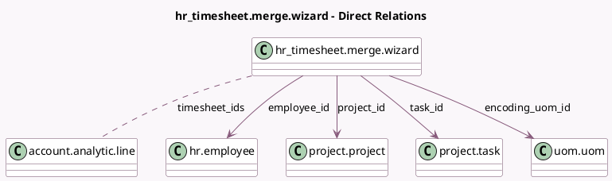

<!-- GENERATED:MODEL -->
---
tags: [odoo, enterprise, generated, model]
---

# hr_timesheet.merge.wizard

- Module: [[docs/Enterprise Addons/timesheet_grid/timesheet_grid|timesheet_grid]]
- Scope: Enterprise Addons
- Defined in module: yes
- Source files: `wizard/hr_timesheet_merge_wizard.py`
- Python classes: `Hr_TimesheetMergeWizard`
- Description: Merge Timesheets

## Field footprint

- Detected fields: 8
- Field types: `Char` x 1, `Date` x 1, `Float` x 1, `Many2many` x 1, `Many2one` x 4
- Relation fields: 5

## Sample fields

- `date`: `Date` (comodel `Date`)
- `employee_id`: `Many2one` (comodel `hr.employee`)
- `encoding_uom_id`: `Many2one` (comodel `uom.uom`)
- `name`: `Char` (comodel `Description`, compute `_compute_name`, store `True`)
- `project_id`: `Many2one` (comodel `project.project`)
- `task_id`: `Many2one` (comodel `project.task`, compute `_compute_task_id`, store `True`)
- `timesheet_ids`: `Many2many` (comodel `account.analytic.line`)
- `unit_amount`: `Float` (comodel `Quantity`, compute `_compute_unit_amount`, store `True`)

## Method hints

- Detected methods: 7
- Action methods: `action_merge`
- Compute methods: `_compute_name`, `_compute_task_id`, `_compute_unit_amount`
- Onchange methods: none

## Direct relation diagram

## Navigation

- **Parent:** [[docs/Enterprise Addons/timesheet_grid/Models]]

<!-- GENERATED:MODEL -->
