<!-- GENERATED:MODEL -->
---
tags: [odoo, enterprise, generated, model]
---

# project.task

- Module: [[docs/Enterprise Addons/timesheet_grid/timesheet_grid|timesheet_grid]]
- Scope: Enterprise Addons
- Defined in module: yes
- Source files: `models/project_task.py`
- Python classes: `ProjectTask`
- Inherits: `timer.parent.mixin`, `timesheet.grid.mixin`

## Field footprint

- Detected fields: 6
- Field types: `Boolean` x 2, `Datetime` x 2, `Float` x 1, `One2many` x 1
- Relation fields: 1

## Sample fields

- `display_timesheet_timer`: `Boolean` (comodel `Display Timesheet Time`, compute `_compute_display_timesheet_timer`)
- `is_timer_running`: `Boolean`
- `timer_pause`: `Datetime`
- `timer_start`: `Datetime`
- `timesheet_unit_amount`: `Float` (compute `_compute_timesheet_unit_amount`)
- `user_timer_id`: `One2many`

## Method hints

- Detected methods: 16
- Action methods: `action_timer_start`, `action_timer_stop`, `action_view_subtask_timesheet`
- Compute methods: `_compute_allocated_hours`, `_compute_display_timesheet_timer`, `_compute_timesheet_unit_amount`
- Onchange methods: `_onchange_project_id`

## Direct relation diagram

```plantuml
@startuml
!define ODOO_COLOR_PRIMARY #714B67
!define ODOO_COLOR_ACCENT #875A7B
!define ODOO_COLOR_BG #FAF7FA

skinparam backgroundColor ODOO_COLOR_BG
skinparam defaultTextAlignment left
skinparam ArrowColor ODOO_COLOR_ACCENT
skinparam ClassBackgroundColor white
skinparam ClassBorderColor ODOO_COLOR_PRIMARY
skinparam ComponentBackgroundColor white
skinparam ComponentBorderColor ODOO_COLOR_PRIMARY
skinparam NoteBackgroundColor #FFF8FF
skinparam NoteBorderColor ODOO_COLOR_ACCENT
skinparam SequenceLifeLineBorderColor ODOO_COLOR_ACCENT
skinparam SequenceLifeLineBackgroundColor #FFFFFF
skinparam SequenceParticipantBorderColor ODOO_COLOR_PRIMARY
skinparam SequenceParticipantBackgroundColor #FFFFFF
skinparam sequence {
  ArrowColor ODOO_COLOR_ACCENT
  ActorBorderColor ODOO_COLOR_PRIMARY
}
title project.task - Direct Relations
class "project.task" as project_task
@enduml
```

## Navigation

- **Parent:** [[docs/Enterprise Addons/timesheet_grid/Models]]

<!-- GENERATED:MODEL -->
