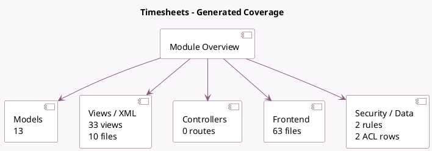

<!-- GENERATED:MODULE -->
---
tags: [odoo, enterprise, module]
---

# Timesheets

- Scope: Enterprise Addons
- Source: enterprise/timesheet_grid
- Dependencies: [[docs/Enterprise Addons/project_enterprise/project_enterprise|project_enterprise]], [[docs/Enterprise Addons/web_grid/web_grid|web_grid]], [[docs/Community Addons/hr_timesheet/hr_timesheet|hr_timesheet]], [[docs/Enterprise Addons/timer/timer|timer]], [[docs/Community Addons/hr_org_chart/hr_org_chart|hr_org_chart]]

## Summary

Track employee time on tasks

## Generated coverage

- Models: 13
- XML files with UI/data artifacts: 10
- Views: 33
- Actions: 26
- Menus: 3
- Rules (ir.rule): 2
- Access CSV entries: 2
- Controller units: 0
- Frontend asset files: 63

## Module map

## Detail notes

- Models: [[docs/Enterprise Addons/timesheet_grid/Models|Models]] (13)
- Views and XML: [[docs/Enterprise Addons/timesheet_grid/Views|Views]] (10 files)
- Frontend: [[docs/Enterprise Addons/timesheet_grid/Frontend|Frontend]] (63 files)

## Key models

- `account.analytic.line`
- `hr.employee`
- `hr.employee.public`
- `hr.timesheet.stop.timer.confirmation.wizard`
- `hr_timesheet.merge.wizard`
- `ir.module.module`
- `project.project`
- `project.task`
- `res.company`
- `res.config.settings`
- `res.users`
- `timesheet.grid.mixin`

## Navigation

- [[../Enterprise Addons/Enterprise Addons|Back to scope]]
- [[../../docs/docs|Back to docs]]

<!-- GENERATED:MODULE -->

