<!-- GENERATED:MODEL -->
---
tags: [odoo, enterprise, generated, model]
---

# res.users

- Module: [[docs/Enterprise Addons/voip/voip|voip]]
- Scope: Enterprise Addons
- Defined in module: extension only
- Source files: `models/res_users.py`
- Python classes: `ResUsers`

## Field footprint

- Detected fields: 7
- Field types: `Boolean` x 1, `Char` x 3, `Many2one` x 2, `Selection` x 1
- Relation fields: 2

## Sample fields

- `external_device_number`: `Char` (compute `_compute_external_device_number`)
- `how_to_call_on_mobile`: `Selection` (compute `_compute_how_to_call_on_mobile`)
- `last_seen_phone_call`: `Many2one` (comodel `voip.call`)
- `should_call_from_another_device`: `Boolean` (compute `_compute_should_call_from_another_device`)
- `voip_provider_id`: `Many2one` (comodel `voip.provider`, compute `_compute_voip_provider_id`)
- `voip_secret`: `Char` (compute `_compute_voip_secret`)
- `voip_username`: `Char` (compute `_compute_voip_username`)

## Method hints

- Detected methods: 13
- Action methods: none
- Compute methods: `_compute_external_device_number`, `_compute_how_to_call_on_mobile`, `_compute_should_call_from_another_device`, `_compute_voip_provider_id`, `_compute_voip_secret`, `_compute_voip_username`
- Onchange methods: none

## Direct relation diagram

```plantuml
@startuml
!define ODOO_COLOR_PRIMARY #714B67
!define ODOO_COLOR_ACCENT #875A7B
!define ODOO_COLOR_BG #FAF7FA

skinparam backgroundColor ODOO_COLOR_BG
skinparam defaultTextAlignment left
skinparam ArrowColor ODOO_COLOR_ACCENT
skinparam ClassBackgroundColor white
skinparam ClassBorderColor ODOO_COLOR_PRIMARY
skinparam ComponentBackgroundColor white
skinparam ComponentBorderColor ODOO_COLOR_PRIMARY
skinparam NoteBackgroundColor #FFF8FF
skinparam NoteBorderColor ODOO_COLOR_ACCENT
skinparam SequenceLifeLineBorderColor ODOO_COLOR_ACCENT
skinparam SequenceLifeLineBackgroundColor #FFFFFF
skinparam SequenceParticipantBorderColor ODOO_COLOR_PRIMARY
skinparam SequenceParticipantBackgroundColor #FFFFFF
skinparam sequence {
  ArrowColor ODOO_COLOR_ACCENT
  ActorBorderColor ODOO_COLOR_PRIMARY
}
title res.users - Direct Relations
class "res.users" as res_users
class "voip.call" as voip_call
class "voip.provider" as voip_provider
res_users --> voip_call : last_seen_phone_call
res_users --> voip_provider : voip_provider_id
@enduml
```

## Navigation

- **Parent:** [[docs/Enterprise Addons/voip/Models]]

<!-- GENERATED:MODEL -->
