<!-- GENERATED:MODEL -->
---
tags: [odoo, enterprise, generated, model]
---

# voip.call

- Module: [[docs/Enterprise Addons/voip/voip|voip]]
- Scope: Enterprise Addons
- Defined in module: yes
- Source files: `models/voip_call.py`
- Python classes: `VoipCall`
- Description: Phone call
- Inherits: `mail.thread.main.attachment`, `voip.country.code.mixin`

## Field footprint

- Detected fields: 15
- Field types: `Binary` x 2, `Boolean` x 1, `Char` x 3, `Datetime` x 2, `Float` x 1, `Integer` x 1, `Many2one` x 3, `Selection` x 2
- Relation fields: 3

## Sample fields

- `activity_name`: `Char`
- `avatar_128`: `Binary` (related `partner_id.avatar_128`)
- `call_count`: `Integer` (compute `_compute_call_count`)
- `country_flag_url`: `Char` (related `country_id.image_url`)
- `country_id`: `Many2one` (comodel `res.country`, compute `_compute_country_id`, store `True`)
- `direction`: `Selection`
- `duration`: `Float` (compute `_compute_duration`)
- `end_date`: `Datetime`
- `image_1920`: `Binary` (related `partner_id.image_1920`)
- `is_within_same_company`: `Boolean` (compute `_compute_is_within_same_company`, store `True`)
- `partner_id`: `Many2one` (comodel `res.partner`)
- `phone_number`: `Char`
- `start_date`: `Datetime`
- `state`: `Selection`
- `user_id`: `Many2one` (comodel `res.users`)

## Method hints

- Detected methods: 18
- Action methods: `action_open_calls`
- Compute methods: `_compute_call_count`, `_compute_country_id`, `_compute_display_name`, `_compute_duration`, `_compute_is_within_same_company`
- Onchange methods: none

## Direct relation diagram

```plantuml
@startuml
!define ODOO_COLOR_PRIMARY #714B67
!define ODOO_COLOR_ACCENT #875A7B
!define ODOO_COLOR_BG #FAF7FA

skinparam backgroundColor ODOO_COLOR_BG
skinparam defaultTextAlignment left
skinparam ArrowColor ODOO_COLOR_ACCENT
skinparam ClassBackgroundColor white
skinparam ClassBorderColor ODOO_COLOR_PRIMARY
skinparam ComponentBackgroundColor white
skinparam ComponentBorderColor ODOO_COLOR_PRIMARY
skinparam NoteBackgroundColor #FFF8FF
skinparam NoteBorderColor ODOO_COLOR_ACCENT
skinparam SequenceLifeLineBorderColor ODOO_COLOR_ACCENT
skinparam SequenceLifeLineBackgroundColor #FFFFFF
skinparam SequenceParticipantBorderColor ODOO_COLOR_PRIMARY
skinparam SequenceParticipantBackgroundColor #FFFFFF
skinparam sequence {
  ArrowColor ODOO_COLOR_ACCENT
  ActorBorderColor ODOO_COLOR_PRIMARY
}
title voip.call - Direct Relations
class "voip.call" as voip_call
class "res.country" as res_country
class "res.partner" as res_partner
class "res.users" as res_users
voip_call --> res_partner : partner_id
voip_call --> res_users : user_id
voip_call --> res_country : country_id
@enduml
```

## Navigation

- **Parent:** [[docs/Enterprise Addons/voip/Models]]

<!-- GENERATED:MODEL -->
