<!-- GENERATED:MODEL -->
---
tags: [odoo, enterprise, generated, model]
---

# voip.country.code.mixin

- Module: [[docs/Enterprise Addons/voip/voip|voip]]
- Scope: Enterprise Addons
- Defined in module: yes
- Source files: `models/voip_country_code_mixin.py`
- Python classes: `VoipCountryCode`
- Description: Phone Country Mixin

## Field footprint

- Detected fields: 2
- Field types: `Char` x 1, `Many2one` x 1
- Relation fields: 1

## Sample fields

- `country_code_from_phone`: `Char` (compute `_compute_phone_country_id`)
- `phone_country_id`: `Many2one` (comodel `res.country`, compute `_compute_phone_country_id`)

## Method hints

- Detected methods: 1
- Action methods: none
- Compute methods: `_compute_phone_country_id`
- Onchange methods: none

## Direct relation diagram

```plantuml
@startuml
!define ODOO_COLOR_PRIMARY #714B67
!define ODOO_COLOR_ACCENT #875A7B
!define ODOO_COLOR_BG #FAF7FA

skinparam backgroundColor ODOO_COLOR_BG
skinparam defaultTextAlignment left
skinparam ArrowColor ODOO_COLOR_ACCENT
skinparam ClassBackgroundColor white
skinparam ClassBorderColor ODOO_COLOR_PRIMARY
skinparam ComponentBackgroundColor white
skinparam ComponentBorderColor ODOO_COLOR_PRIMARY
skinparam NoteBackgroundColor #FFF8FF
skinparam NoteBorderColor ODOO_COLOR_ACCENT
skinparam SequenceLifeLineBorderColor ODOO_COLOR_ACCENT
skinparam SequenceLifeLineBackgroundColor #FFFFFF
skinparam SequenceParticipantBorderColor ODOO_COLOR_PRIMARY
skinparam SequenceParticipantBackgroundColor #FFFFFF
skinparam sequence {
  ArrowColor ODOO_COLOR_ACCENT
  ActorBorderColor ODOO_COLOR_PRIMARY
}
title voip.country.code.mixin - Direct Relations
class "voip.country.code.mixin" as voip_country_code_mixin
class "res.country" as res_country
voip_country_code_mixin --> res_country : phone_country_id
@enduml
```

## Navigation

- **Parent:** [[docs/Enterprise Addons/voip/Models]]

<!-- GENERATED:MODEL -->
