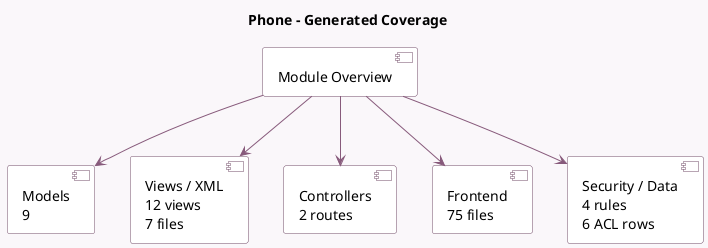

<!-- GENERATED:MODULE -->
---
tags: [odoo, enterprise, module]
---

# Phone

- Scope: Enterprise Addons
- Source: enterprise/voip
- Dependencies: base (not documented), [[docs/Community Addons/mail/mail|mail]], [[docs/Community Addons/phone_validation/phone_validation|phone_validation]], [[docs/Community Addons/web/web|web]], [[docs/Enterprise Addons/web_mobile/web_mobile|web_mobile]]

## Summary

Make and receive phone calls from within Odoo.

## Generated coverage

- Models: 9
- XML files with UI/data artifacts: 7
- Views: 12
- Actions: 3
- Menus: 5
- Rules (ir.rule): 4
- Access CSV entries: 6
- Controller units: 1
- Frontend asset files: 75

## Module map

## Detail notes

- Models: [[docs/Enterprise Addons/voip/Models|Models]] (9)
- Views and XML: [[docs/Enterprise Addons/voip/Views|Views]] (7 files)
- Controllers: [[docs/Enterprise Addons/voip/Controllers|Controllers]] (1)
- Frontend: [[docs/Enterprise Addons/voip/Frontend|Frontend]] (75 files)

## Key models

- `mail.activity`
- `res.country`
- `res.partner`
- `res.users`
- `res.users.settings`
- `voip.call`
- `voip.country.code.mixin`
- `voip.provider`
- `voip.queue.mixin`

## Navigation

- [[../Enterprise Addons/Enterprise Addons|Back to scope]]
- [[../../docs/docs|Back to docs]]

<!-- GENERATED:MODULE -->

