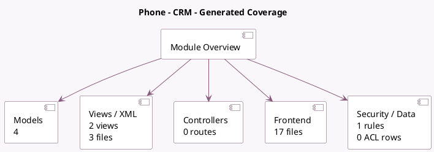

<!-- GENERATED:MODULE -->
---
tags: [odoo, enterprise, module]
---

# Phone - CRM

- Scope: Enterprise Addons
- Source: enterprise/voip_crm
- Dependencies: [[docs/Community Addons/crm/crm|crm]], [[docs/Enterprise Addons/voip/voip|voip]]

## Summary

Phone integration with CRM module.

## Generated coverage

- Models: 4
- XML files with UI/data artifacts: 3
- Views: 2
- Actions: 0
- Menus: 0
- Rules (ir.rule): 1
- Access CSV entries: 0
- Controller units: 0
- Frontend asset files: 17

## Module map

## Detail notes

- Models: [[docs/Enterprise Addons/voip_crm/Models|Models]] (4)
- Views and XML: [[docs/Enterprise Addons/voip_crm/Views|Views]] (3 files)
- Frontend: [[docs/Enterprise Addons/voip_crm/Frontend|Frontend]] (17 files)

## Key models

- `crm.lead`
- `ir.http`
- `res.partner`
- `voip.call`

## Navigation

- [[../Enterprise Addons/Enterprise Addons|Back to scope]]
- [[../../docs/docs|Back to docs]]

<!-- GENERATED:MODULE -->

