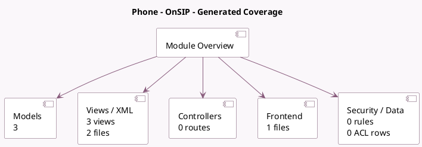

<!-- GENERATED:MODULE -->
---
tags: [odoo, enterprise, module]
---

# Phone - OnSIP

- Scope: Enterprise Addons
- Source: enterprise/voip_onsip
- Dependencies: [[docs/Enterprise Addons/voip/voip|voip]]

## Generated coverage

- Models: 3
- XML files with UI/data artifacts: 2
- Views: 3
- Actions: 0
- Menus: 0
- Rules (ir.rule): 0
- Access CSV entries: 0
- Controller units: 0
- Frontend asset files: 1

## Module map

## Detail notes

- Models: [[docs/Enterprise Addons/voip_onsip/Models|Models]] (3)
- Views and XML: [[docs/Enterprise Addons/voip_onsip/Views|Views]] (2 files)
- Frontend: [[docs/Enterprise Addons/voip_onsip/Frontend|Frontend]] (1 files)

## Key models

- `res.users`
- `res.users.settings`
- `voip.provider`

## Navigation

- [[../Enterprise Addons/Enterprise Addons|Back to scope]]
- [[../../docs/docs|Back to docs]]

<!-- GENERATED:MODULE -->

