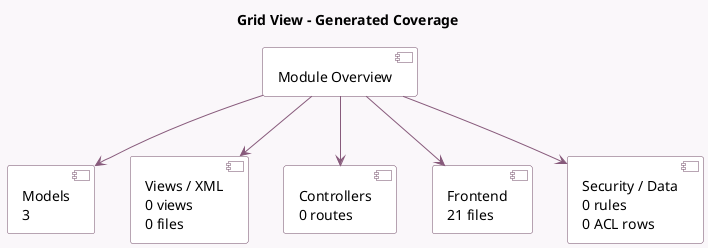

<!-- GENERATED:MODULE -->
---
tags: [odoo, enterprise, module]
---

# Grid View

- Scope: Enterprise Addons
- Source: enterprise/web_grid
- Dependencies: [[docs/Community Addons/web/web|web]]

## Summary

Basic 2D Grid view for odoo

## Generated coverage

- Models: 3
- XML files with UI/data artifacts: 0
- Views: 0
- Actions: 0
- Menus: 0
- Rules (ir.rule): 0
- Access CSV entries: 0
- Controller units: 0
- Frontend asset files: 21

## Module map

## Detail notes

- Models: [[docs/Enterprise Addons/web_grid/Models|Models]] (3)
- Frontend: [[docs/Enterprise Addons/web_grid/Frontend|Frontend]] (21 files)

## Key models

- `base`
- `ir.actions.act_window.view`
- `ir.ui.view`

## Navigation

- [[../Enterprise Addons/Enterprise Addons|Back to scope]]
- [[../../docs/docs|Back to docs]]

<!-- GENERATED:MODULE -->

