<!-- GENERATED:MODEL -->
---
tags: [odoo, enterprise, generated, model]
---

# studio.approval.entry

- Module: [[docs/Enterprise Addons/web_studio/web_studio|web_studio]]
- Scope: Enterprise Addons
- Defined in module: yes
- Source files: `models/studio_approval.py`
- Python classes: `StudioApprovalEntry`
- Description: Studio Approval Entry

## Field footprint

- Detected fields: 9
- Field types: `Boolean` x 1, `Char` x 4, `Many2one` x 3, `Many2oneReference` x 1
- Relation fields: 3

## Sample fields

- `action_id`: `Many2one` (comodel `ir.actions.actions`, related `rule_id.action_id`, store `True`)
- `approved`: `Boolean`
- `method`: `Char` (related `rule_id.method`, store `True`)
- `model`: `Char` (related `rule_id.model_name`, store `True`)
- `name`: `Char` (compute `_compute_name`, store `True`)
- `reference`: `Char` (compute `_compute_reference`)
- `res_id`: `Many2oneReference`
- `rule_id`: `Many2one` (comodel `studio.approval.rule`)
- `user_id`: `Many2one` (comodel `res.users`)

## Method hints

- Detected methods: 7
- Action methods: none
- Compute methods: `_compute_name`, `_compute_reference`
- Onchange methods: none

## Direct relation diagram

```plantuml
@startuml
!define ODOO_COLOR_PRIMARY #714B67
!define ODOO_COLOR_ACCENT #875A7B
!define ODOO_COLOR_BG #FAF7FA

skinparam backgroundColor ODOO_COLOR_BG
skinparam defaultTextAlignment left
skinparam ArrowColor ODOO_COLOR_ACCENT
skinparam ClassBackgroundColor white
skinparam ClassBorderColor ODOO_COLOR_PRIMARY
skinparam ComponentBackgroundColor white
skinparam ComponentBorderColor ODOO_COLOR_PRIMARY
skinparam NoteBackgroundColor #FFF8FF
skinparam NoteBorderColor ODOO_COLOR_ACCENT
skinparam SequenceLifeLineBorderColor ODOO_COLOR_ACCENT
skinparam SequenceLifeLineBackgroundColor #FFFFFF
skinparam SequenceParticipantBorderColor ODOO_COLOR_PRIMARY
skinparam SequenceParticipantBackgroundColor #FFFFFF
skinparam sequence {
  ArrowColor ODOO_COLOR_ACCENT
  ActorBorderColor ODOO_COLOR_PRIMARY
}
title studio.approval.entry - Direct Relations
class "studio.approval.entry" as studio_approval_entry
class "ir.actions.actions" as ir_actions_actions
class "res.users" as res_users
class "studio.approval.rule" as studio_approval_rule
studio_approval_entry --> res_users : user_id
studio_approval_entry --> studio_approval_rule : rule_id
studio_approval_entry --> ir_actions_actions : action_id
@enduml
```

## Navigation

- **Parent:** [[docs/Enterprise Addons/web_studio/Models]]

<!-- GENERATED:MODEL -->
