<!-- GENERATED:MODEL -->
---
tags: [odoo, enterprise, generated, model]
---

# studio.approval.request

- Module: [[docs/Enterprise Addons/web_studio/web_studio|web_studio]]
- Scope: Enterprise Addons
- Defined in module: yes
- Source files: `models/studio_approval.py`
- Python classes: `StudioApprovalRequest`
- Description: Studio Approval Request

## Field footprint

- Detected fields: 3
- Field types: `Many2one` x 2, `Many2oneReference` x 1
- Relation fields: 2

## Sample fields

- `mail_activity_id`: `Many2one` (comodel `mail.activity`)
- `res_id`: `Many2oneReference`
- `rule_id`: `Many2one` (comodel `studio.approval.rule`)

## Method hints

- Detected methods: 1
- Action methods: none
- Compute methods: none
- Onchange methods: none

## Direct relation diagram

```plantuml
@startuml
!define ODOO_COLOR_PRIMARY #714B67
!define ODOO_COLOR_ACCENT #875A7B
!define ODOO_COLOR_BG #FAF7FA

skinparam backgroundColor ODOO_COLOR_BG
skinparam defaultTextAlignment left
skinparam ArrowColor ODOO_COLOR_ACCENT
skinparam ClassBackgroundColor white
skinparam ClassBorderColor ODOO_COLOR_PRIMARY
skinparam ComponentBackgroundColor white
skinparam ComponentBorderColor ODOO_COLOR_PRIMARY
skinparam NoteBackgroundColor #FFF8FF
skinparam NoteBorderColor ODOO_COLOR_ACCENT
skinparam SequenceLifeLineBorderColor ODOO_COLOR_ACCENT
skinparam SequenceLifeLineBackgroundColor #FFFFFF
skinparam SequenceParticipantBorderColor ODOO_COLOR_PRIMARY
skinparam SequenceParticipantBackgroundColor #FFFFFF
skinparam sequence {
  ArrowColor ODOO_COLOR_ACCENT
  ActorBorderColor ODOO_COLOR_PRIMARY
}
title studio.approval.request - Direct Relations
class "studio.approval.request" as studio_approval_request
class "mail.activity" as mail_activity
class "studio.approval.rule" as studio_approval_rule
studio_approval_request --> mail_activity : mail_activity_id
studio_approval_request --> studio_approval_rule : rule_id
@enduml
```

## Navigation

- **Parent:** [[docs/Enterprise Addons/web_studio/Models]]

<!-- GENERATED:MODEL -->
