<!-- GENERATED:MODEL -->
---
tags: [odoo, enterprise, generated, model]
---

# studio.approval.rule.delegate

- Module: [[docs/Enterprise Addons/web_studio/web_studio|web_studio]]
- Scope: Enterprise Addons
- Defined in module: yes
- Source files: `models/studio_approval.py`
- Python classes: `StudioApprovalRuleDelegate`
- Description: Approval Rule Delegate

## Field footprint

- Detected fields: 4
- Field types: `Date` x 1, `Many2many` x 2, `Many2one` x 1
- Relation fields: 3

## Sample fields

- `approval_rule_id`: `Many2one` (comodel `studio.approval.rule`)
- `approver_ids`: `Many2many` (comodel `res.users`)
- `date_to`: `Date`
- `users_to_notify`: `Many2many` (comodel `res.users`)

## Method hints

- Detected methods: 2
- Action methods: none
- Compute methods: none
- Onchange methods: none

## Direct relation diagram

```plantuml
@startuml
!define ODOO_COLOR_PRIMARY #714B67
!define ODOO_COLOR_ACCENT #875A7B
!define ODOO_COLOR_BG #FAF7FA

skinparam backgroundColor ODOO_COLOR_BG
skinparam defaultTextAlignment left
skinparam ArrowColor ODOO_COLOR_ACCENT
skinparam ClassBackgroundColor white
skinparam ClassBorderColor ODOO_COLOR_PRIMARY
skinparam ComponentBackgroundColor white
skinparam ComponentBorderColor ODOO_COLOR_PRIMARY
skinparam NoteBackgroundColor #FFF8FF
skinparam NoteBorderColor ODOO_COLOR_ACCENT
skinparam SequenceLifeLineBorderColor ODOO_COLOR_ACCENT
skinparam SequenceLifeLineBackgroundColor #FFFFFF
skinparam SequenceParticipantBorderColor ODOO_COLOR_PRIMARY
skinparam SequenceParticipantBackgroundColor #FFFFFF
skinparam sequence {
  ArrowColor ODOO_COLOR_ACCENT
  ActorBorderColor ODOO_COLOR_PRIMARY
}
title studio.approval.rule.delegate - Direct Relations
class "studio.approval.rule.delegate" as studio_approval_rule_delegate
class "res.users" as res_users
class "studio.approval.rule" as studio_approval_rule
studio_approval_rule_delegate --> studio_approval_rule : approval_rule_id
studio_approval_rule_delegate .. res_users : approver_ids
studio_approval_rule_delegate .. res_users : users_to_notify
@enduml
```

## Navigation

- **Parent:** [[docs/Enterprise Addons/web_studio/Models]]

<!-- GENERATED:MODEL -->
