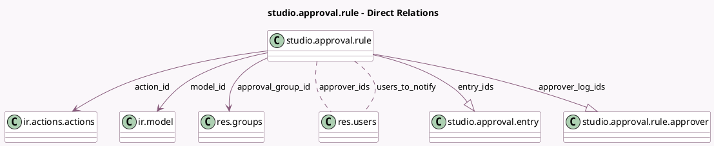

<!-- GENERATED:MODEL -->
---
tags: [odoo, enterprise, generated, model]
---

# studio.approval.rule

- Module: [[docs/Enterprise Addons/web_studio/web_studio|web_studio]]
- Scope: Enterprise Addons
- Defined in module: yes
- Source files: `models/studio_approval.py`
- Python classes: `StudioApprovalRule`
- Description: Studio Approval Rule
- Inherits: `mail.thread`, `studio.mixin`

## Field footprint

- Detected fields: 20
- Field types: `Boolean` x 4, `Char` x 6, `Integer` x 2, `Many2many` x 2, `Many2one` x 3, `One2many` x 2, `Selection` x 1
- Relation fields: 7

## Sample fields

- `action_id`: `Many2one` (comodel `ir.actions.actions`)
- `action_xmlid`: `Char` (related `action_id.xml_id`)
- `active`: `Boolean`
- `approval_group_id`: `Many2one` (comodel `res.groups`)
- `approver_ids`: `Many2many` (comodel `res.users`, compute `_compute_approver_ids`)
- `approver_log_ids`: `One2many` (comodel `studio.approval.rule.approver`)
- `can_validate`: `Boolean` (compute `_compute_can_validate`)
- `conditional`: `Boolean` (compute `_compute_conditional`)
- `domain`: `Char`
- `entries_count`: `Integer` (comodel `Number of Entries`, compute `_compute_entries_count`)
- `entry_ids`: `One2many` (comodel `studio.approval.entry`)
- `exclusive_user`: `Boolean`
- `kanban_color`: `Integer` (compute `_compute_kanban_color`)
- `message`: `Char`
- `method`: `Char`
- `model_id`: `Many2one` (comodel `ir.model`)
- `model_name`: `Char` (related `model_id.model`, store `True`)
- `name`: `Char`
- `notification_order`: `Selection`
- `users_to_notify`: `Many2many` (comodel `res.users`)

## Method hints

- Detected methods: 41
- Action methods: none
- Compute methods: `_compute_approver_ids`, `_compute_can_validate`, `_compute_conditional`, `_compute_display_name`, `_compute_entries_count`, `_compute_kanban_color`
- Onchange methods: none

## Direct relation diagram

## Navigation

- **Parent:** [[docs/Enterprise Addons/web_studio/Models]]

<!-- GENERATED:MODEL -->
