<!-- GENERATED:MODEL -->
---
tags: [odoo, enterprise, generated, model]
---

# studio.export.model

- Module: [[docs/Enterprise Addons/web_studio/web_studio|web_studio]]
- Scope: Enterprise Addons
- Defined in module: yes
- Source files: `models/studio_export_model.py`
- Python classes: `StudioExportModel`
- Description: Studio Export Models

## Field footprint

- Detected fields: 9
- Field types: `Boolean` x 3, `Char` x 2, `Integer` x 1, `Many2many` x 1, `Many2one` x 1, `Text` x 1
- Relation fields: 2

## Sample fields

- `domain`: `Text`
- `excluded_fields`: `Many2many` (comodel `ir.model.fields`, compute `_compute_excluded_fields`, store `True`)
- `include_attachment`: `Boolean`
- `is_demo_data`: `Boolean`
- `model_id`: `Many2one` (comodel `ir.model`)
- `model_name`: `Char` (related `model_id.model`, store `True`)
- `records_count`: `Char` (compute `_compute_records_count`)
- `sequence`: `Integer`
- `updatable`: `Boolean`

## Method hints

- Detected methods: 5
- Action methods: `action_preset`
- Compute methods: `_compute_display_name`, `_compute_excluded_fields`, `_compute_records_count`
- Onchange methods: none

## Direct relation diagram

```plantuml
@startuml
!define ODOO_COLOR_PRIMARY #714B67
!define ODOO_COLOR_ACCENT #875A7B
!define ODOO_COLOR_BG #FAF7FA

skinparam backgroundColor ODOO_COLOR_BG
skinparam defaultTextAlignment left
skinparam ArrowColor ODOO_COLOR_ACCENT
skinparam ClassBackgroundColor white
skinparam ClassBorderColor ODOO_COLOR_PRIMARY
skinparam ComponentBackgroundColor white
skinparam ComponentBorderColor ODOO_COLOR_PRIMARY
skinparam NoteBackgroundColor #FFF8FF
skinparam NoteBorderColor ODOO_COLOR_ACCENT
skinparam SequenceLifeLineBorderColor ODOO_COLOR_ACCENT
skinparam SequenceLifeLineBackgroundColor #FFFFFF
skinparam SequenceParticipantBorderColor ODOO_COLOR_PRIMARY
skinparam SequenceParticipantBackgroundColor #FFFFFF
skinparam sequence {
  ArrowColor ODOO_COLOR_ACCENT
  ActorBorderColor ODOO_COLOR_PRIMARY
}
title studio.export.model - Direct Relations
class "studio.export.model" as studio_export_model
class "ir.model" as ir_model
class "ir.model.fields" as ir_model_fields
studio_export_model --> ir_model : model_id
studio_export_model .. ir_model_fields : excluded_fields
@enduml
```

## Navigation

- **Parent:** [[docs/Enterprise Addons/web_studio/Models]]

<!-- GENERATED:MODEL -->
