<!-- GENERATED:MODEL -->
---
tags: [odoo, enterprise, generated, model]
---

# studio.export.wizard

- Module: [[docs/Enterprise Addons/web_studio/web_studio|web_studio]]
- Scope: Enterprise Addons
- Defined in module: yes
- Source files: `wizard/studio_export_wizard.py`
- Python classes: `StudioExportWizard`
- Description: Studio Export Wizard

## Field footprint

- Detected fields: 5
- Field types: `Boolean` x 2, `Many2many` x 3
- Relation fields: 3

## Sample fields

- `additional_export_data`: `Many2many` (comodel `studio.export.wizard.data`, compute `_compute_export_data`)
- `additional_models`: `Many2many` (comodel `studio.export.model`, compute `_compute_additional_models`)
- `default_export_data`: `Many2many` (comodel `studio.export.wizard.data`)
- `include_additional_data`: `Boolean`
- `include_demo_data`: `Boolean`

## Method hints

- Detected methods: 10
- Action methods: none
- Compute methods: `_compute_additional_models`, `_compute_export_data`
- Onchange methods: `_onchange_include_additional_data`, `_onchange_include_demo_data`

## Direct relation diagram

```plantuml
@startuml
!define ODOO_COLOR_PRIMARY #714B67
!define ODOO_COLOR_ACCENT #875A7B
!define ODOO_COLOR_BG #FAF7FA

skinparam backgroundColor ODOO_COLOR_BG
skinparam defaultTextAlignment left
skinparam ArrowColor ODOO_COLOR_ACCENT
skinparam ClassBackgroundColor white
skinparam ClassBorderColor ODOO_COLOR_PRIMARY
skinparam ComponentBackgroundColor white
skinparam ComponentBorderColor ODOO_COLOR_PRIMARY
skinparam NoteBackgroundColor #FFF8FF
skinparam NoteBorderColor ODOO_COLOR_ACCENT
skinparam SequenceLifeLineBorderColor ODOO_COLOR_ACCENT
skinparam SequenceLifeLineBackgroundColor #FFFFFF
skinparam SequenceParticipantBorderColor ODOO_COLOR_PRIMARY
skinparam SequenceParticipantBackgroundColor #FFFFFF
skinparam sequence {
  ArrowColor ODOO_COLOR_ACCENT
  ActorBorderColor ODOO_COLOR_PRIMARY
}
title studio.export.wizard - Direct Relations
class "studio.export.wizard" as studio_export_wizard
class "studio.export.model" as studio_export_model
class "studio.export.wizard.data" as studio_export_wizard_data
studio_export_wizard .. studio_export_wizard_data : default_export_data
studio_export_wizard .. studio_export_model : additional_models
studio_export_wizard .. studio_export_wizard_data : additional_export_data
@enduml
```

## Navigation

- **Parent:** [[docs/Enterprise Addons/web_studio/Models]]

<!-- GENERATED:MODEL -->
