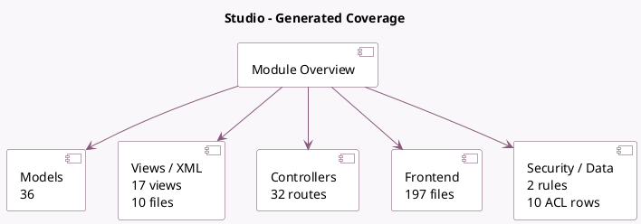

<!-- GENERATED:MODULE -->
---
tags: [odoo, enterprise, module]
---

# Studio

- Scope: Enterprise Addons
- Source: enterprise/web_studio
- Dependencies: [[docs/Community Addons/base_automation/base_automation|base_automation]], [[docs/Community Addons/base_import_module/base_import_module|base_import_module]], [[docs/Community Addons/mail/mail|mail]], [[docs/Community Addons/web/web|web]], [[docs/Enterprise Addons/web_enterprise/web_enterprise|web_enterprise]], [[docs/Community Addons/html_editor/html_editor|html_editor]], [[docs/Enterprise Addons/web_map/web_map|web_map]], [[docs/Enterprise Addons/web_gantt/web_gantt|web_gantt]], [[docs/Enterprise Addons/web_cohort/web_cohort|web_cohort]], [[docs/Community Addons/sms/sms|sms]]

## Summary

Create and customize your Odoo apps

## Generated coverage

- Models: 36
- XML files with UI/data artifacts: 10
- Views: 17
- Actions: 8
- Menus: 3
- Rules (ir.rule): 2
- Access CSV entries: 10
- Controller units: 4
- Frontend asset files: 197

## Module map

## Detail notes

- Models: [[docs/Enterprise Addons/web_studio/Models|Models]] (36)
- Views and XML: [[docs/Enterprise Addons/web_studio/Views|Views]] (10 files)
- Controllers: [[docs/Enterprise Addons/web_studio/Controllers|Controllers]] (4)
- Frontend: [[docs/Enterprise Addons/web_studio/Frontend|Frontend]] (197 files)

## Key models

- `base`
- `base.automation`
- `base.module.uninstall`
- `ir.actions.act_window`
- `ir.actions.act_window.view`
- `ir.actions.actions`
- `ir.actions.report`
- `ir.actions.server`
- `ir.default`
- `ir.filters`
- `ir.http`
- `ir.model`

## Navigation

- [[../Enterprise Addons/Enterprise Addons|Back to scope]]
- [[../../docs/docs|Back to docs]]

<!-- GENERATED:MODULE -->

