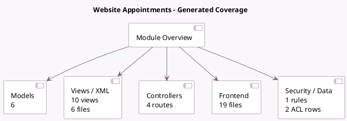

<!-- GENERATED:MODULE -->
---
tags: [odoo, enterprise, module]
---

# Website Appointments

- Scope: Enterprise Addons
- Source: enterprise/website_appointment
- Dependencies: [[docs/Enterprise Addons/appointment/appointment|appointment]], [[docs/Enterprise Addons/website_enterprise/website_enterprise|website_enterprise]], [[docs/Community Addons/website_partner/website_partner|website_partner]], [[docs/Community Addons/html_builder/html_builder|html_builder]]

## Generated coverage

- Models: 6
- XML files with UI/data artifacts: 6
- Views: 10
- Actions: 2
- Menus: 2
- Rules (ir.rule): 1
- Access CSV entries: 2
- Controller units: 3
- Frontend asset files: 19

## Module map

## Detail notes

- Models: [[docs/Enterprise Addons/website_appointment/Models|Models]] (6)
- Views and XML: [[docs/Enterprise Addons/website_appointment/Views|Views]] (6 files)
- Controllers: [[docs/Enterprise Addons/website_appointment/Controllers|Controllers]] (3)
- Frontend: [[docs/Enterprise Addons/website_appointment/Frontend|Frontend]] (19 files)

## Key models

- `appointment.invite`
- `appointment.type`
- `calendar.event`
- `website`
- `website.snippet.filter`
- `website.visitor`

## Navigation

- [[../Enterprise Addons/Enterprise Addons|Back to scope]]
- [[../../docs/docs|Back to docs]]

<!-- GENERATED:MODULE -->

