<!-- GENERATED:MODEL -->
---
tags: [odoo, enterprise, generated, model]
---

# calendar.event

- Module: [[docs/Enterprise Addons/website_appointment_sale/website_appointment_sale|website_appointment_sale]]
- Scope: Enterprise Addons
- Defined in module: extension only
- Source files: `models/calendar_event.py`
- Python classes: `CalendarEvent`

## Field footprint

- Detected fields: 2
- Field types: `Integer` x 1, `One2many` x 1
- Relation fields: 1

## Sample fields

- `sale_order_count`: `Integer` (comodel `Sales Order Count`, compute `_compute_sale_order_count`)
- `sale_order_line_ids`: `One2many` (comodel `sale.order.line`)

## Method hints

- Detected methods: 2
- Action methods: `action_view_sale_order`
- Compute methods: `_compute_sale_order_count`
- Onchange methods: none

## Direct relation diagram

```plantuml
@startuml
!define ODOO_COLOR_PRIMARY #714B67
!define ODOO_COLOR_ACCENT #875A7B
!define ODOO_COLOR_BG #FAF7FA

skinparam backgroundColor ODOO_COLOR_BG
skinparam defaultTextAlignment left
skinparam ArrowColor ODOO_COLOR_ACCENT
skinparam ClassBackgroundColor white
skinparam ClassBorderColor ODOO_COLOR_PRIMARY
skinparam ComponentBackgroundColor white
skinparam ComponentBorderColor ODOO_COLOR_PRIMARY
skinparam NoteBackgroundColor #FFF8FF
skinparam NoteBorderColor ODOO_COLOR_ACCENT
skinparam SequenceLifeLineBorderColor ODOO_COLOR_ACCENT
skinparam SequenceLifeLineBackgroundColor #FFFFFF
skinparam SequenceParticipantBorderColor ODOO_COLOR_PRIMARY
skinparam SequenceParticipantBackgroundColor #FFFFFF
skinparam sequence {
  ArrowColor ODOO_COLOR_ACCENT
  ActorBorderColor ODOO_COLOR_PRIMARY
}
title calendar.event - Direct Relations
class "calendar.event" as calendar_event
class "sale.order.line" as sale_order_line
calendar_event --|> sale_order_line : sale_order_line_ids
@enduml
```

## Navigation

- **Parent:** [[docs/Enterprise Addons/website_appointment_sale/Models]]

<!-- GENERATED:MODEL -->
