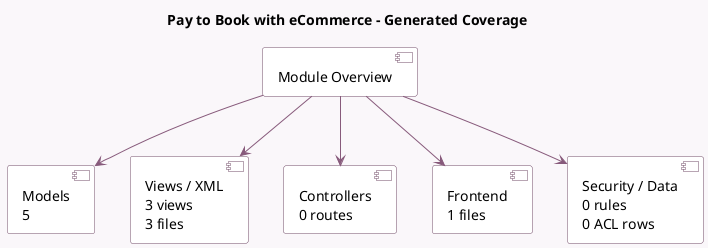

<!-- GENERATED:MODULE -->
---
tags: [odoo, enterprise, module]
---

# Pay to Book with eCommerce

- Scope: Enterprise Addons
- Source: enterprise/website_appointment_sale
- Dependencies: [[docs/Enterprise Addons/website_appointment_account_payment/website_appointment_account_payment|website_appointment_account_payment]], [[docs/Community Addons/website_sale/website_sale|website_sale]]

## Summary

eCommerce on appointments

## Generated coverage

- Models: 5
- XML files with UI/data artifacts: 3
- Views: 3
- Actions: 0
- Menus: 0
- Rules (ir.rule): 0
- Access CSV entries: 0
- Controller units: 0
- Frontend asset files: 1

## Module map

## Detail notes

- Models: [[docs/Enterprise Addons/website_appointment_sale/Models|Models]] (5)
- Views and XML: [[docs/Enterprise Addons/website_appointment_sale/Views|Views]] (3 files)
- Frontend: [[docs/Enterprise Addons/website_appointment_sale/Frontend|Frontend]] (1 files)

## Key models

- `calendar.booking`
- `calendar.event`
- `product.product`
- `sale.order`
- `sale.order.line`

## Navigation

- [[../Enterprise Addons/Enterprise Addons|Back to scope]]
- [[../../docs/docs|Back to docs]]

<!-- GENERATED:MODULE -->

