<!-- GENERATED:MODEL -->
---
tags: [odoo, enterprise, generated, model]
---

# event.track

- Module: [[docs/Enterprise Addons/website_event_track_social/website_event_track_social|website_event_track_social]]
- Scope: Enterprise Addons
- Defined in module: extension only
- Source files: `models/event_track.py`
- Python classes: `EventTrack`

## Field footprint

- Detected fields: 4
- Field types: `Boolean` x 2, `Integer` x 1, `One2many` x 1
- Relation fields: 1

## Sample fields

- `firebase_enable_push_notifications`: `Boolean` (comodel `Enable Web Push Notifications`, compute `_compute_firebase_enable_push_notifications`)
- `push_reminder`: `Boolean` (comodel `Push Reminder`, compute `_compute_push_reminder`, store `True`)
- `push_reminder_delay`: `Integer` (comodel `Push Reminder Delay`, compute `_compute_push_reminder_delay`, store `True`)
- `push_reminder_posts`: `One2many` (comodel `social.post`)

## Method hints

- Detected methods: 7
- Action methods: `action_edit_reminder`
- Compute methods: `_compute_firebase_enable_push_notifications`, `_compute_push_reminder`, `_compute_push_reminder_delay`
- Onchange methods: none

## Direct relation diagram

```plantuml
@startuml
!define ODOO_COLOR_PRIMARY #714B67
!define ODOO_COLOR_ACCENT #875A7B
!define ODOO_COLOR_BG #FAF7FA

skinparam backgroundColor ODOO_COLOR_BG
skinparam defaultTextAlignment left
skinparam ArrowColor ODOO_COLOR_ACCENT
skinparam ClassBackgroundColor white
skinparam ClassBorderColor ODOO_COLOR_PRIMARY
skinparam ComponentBackgroundColor white
skinparam ComponentBorderColor ODOO_COLOR_PRIMARY
skinparam NoteBackgroundColor #FFF8FF
skinparam NoteBorderColor ODOO_COLOR_ACCENT
skinparam SequenceLifeLineBorderColor ODOO_COLOR_ACCENT
skinparam SequenceLifeLineBackgroundColor #FFFFFF
skinparam SequenceParticipantBorderColor ODOO_COLOR_PRIMARY
skinparam SequenceParticipantBackgroundColor #FFFFFF
skinparam sequence {
  ArrowColor ODOO_COLOR_ACCENT
  ActorBorderColor ODOO_COLOR_PRIMARY
}
title event.track - Direct Relations
class "event.track" as event_track
class "social.post" as social_post
event_track --|> social_post : push_reminder_posts
@enduml
```

## Navigation

- **Parent:** [[docs/Enterprise Addons/website_event_track_social/Models]]

<!-- GENERATED:MODEL -->
