<!-- GENERATED:MODEL -->
---
tags: [odoo, enterprise, generated, model]
---

# website.visitor

- Module: [[docs/Enterprise Addons/website_event_track_social/website_event_track_social|website_event_track_social]]
- Scope: Enterprise Addons
- Defined in module: extension only
- Source files: `models/website_visitor.py`
- Python classes: `WebsiteVisitor`

## Field footprint

- Detected fields: 1
- Field types: `Many2many` x 1
- Relation fields: 1

## Sample fields

- `event_track_push_enabled_ids`: `Many2many` (comodel `event.track`, compute `_compute_event_track_push_enabled_ids`)

## Method hints

- Detected methods: 2
- Action methods: none
- Compute methods: `_compute_event_track_push_enabled_ids`
- Onchange methods: none

## Direct relation diagram

```plantuml
@startuml
!define ODOO_COLOR_PRIMARY #714B67
!define ODOO_COLOR_ACCENT #875A7B
!define ODOO_COLOR_BG #FAF7FA

skinparam backgroundColor ODOO_COLOR_BG
skinparam defaultTextAlignment left
skinparam ArrowColor ODOO_COLOR_ACCENT
skinparam ClassBackgroundColor white
skinparam ClassBorderColor ODOO_COLOR_PRIMARY
skinparam ComponentBackgroundColor white
skinparam ComponentBorderColor ODOO_COLOR_PRIMARY
skinparam NoteBackgroundColor #FFF8FF
skinparam NoteBorderColor ODOO_COLOR_ACCENT
skinparam SequenceLifeLineBorderColor ODOO_COLOR_ACCENT
skinparam SequenceLifeLineBackgroundColor #FFFFFF
skinparam SequenceParticipantBorderColor ODOO_COLOR_PRIMARY
skinparam SequenceParticipantBackgroundColor #FFFFFF
skinparam sequence {
  ArrowColor ODOO_COLOR_ACCENT
  ActorBorderColor ODOO_COLOR_PRIMARY
}
title website.visitor - Direct Relations
class "website.visitor" as website_visitor
class "event.track" as event_track
website_visitor .. event_track : event_track_push_enabled_ids
@enduml
```

## Navigation

- **Parent:** [[docs/Enterprise Addons/website_event_track_social/Models]]

<!-- GENERATED:MODEL -->
