<!-- GENERATED:MODEL -->
---
tags: [odoo, enterprise, generated, model]
---

# website_generator.request

- Module: [[docs/Enterprise Addons/website_generator/website_generator|website_generator]]
- Scope: Enterprise Addons
- Defined in module: yes
- Source files: `models/generator.py`
- Python classes: `Website_GeneratorRequest`
- Description: Website Generator Request

## Field footprint

- Detected fields: 9
- Field types: `Boolean` x 1, `Char` x 6, `Integer` x 1, `Many2one` x 1
- Relation fields: 1

## Sample fields

- `additional_urls`: `Char`
- `notified`: `Boolean`
- `page_count`: `Integer`
- `status`: `Char`
- `status_message`: `Char` (compute `_compute_status_message`)
- `target_url`: `Char`
- `uuid`: `Char`
- `version`: `Char`
- `website_id`: `Many2one` (comodel `website`)

## Method hints

- Detected methods: 21
- Action methods: none
- Compute methods: `_compute_status_message`
- Onchange methods: none

## Direct relation diagram

```plantuml
@startuml
!define ODOO_COLOR_PRIMARY #714B67
!define ODOO_COLOR_ACCENT #875A7B
!define ODOO_COLOR_BG #FAF7FA

skinparam backgroundColor ODOO_COLOR_BG
skinparam defaultTextAlignment left
skinparam ArrowColor ODOO_COLOR_ACCENT
skinparam ClassBackgroundColor white
skinparam ClassBorderColor ODOO_COLOR_PRIMARY
skinparam ComponentBackgroundColor white
skinparam ComponentBorderColor ODOO_COLOR_PRIMARY
skinparam NoteBackgroundColor #FFF8FF
skinparam NoteBorderColor ODOO_COLOR_ACCENT
skinparam SequenceLifeLineBorderColor ODOO_COLOR_ACCENT
skinparam SequenceLifeLineBackgroundColor #FFFFFF
skinparam SequenceParticipantBorderColor ODOO_COLOR_PRIMARY
skinparam SequenceParticipantBackgroundColor #FFFFFF
skinparam sequence {
  ArrowColor ODOO_COLOR_ACCENT
  ActorBorderColor ODOO_COLOR_PRIMARY
}
title website_generator.request - Direct Relations
class "website_generator.request" as website_generator_request
class "website" as website
website_generator_request --> website : website_id
@enduml
```

## Navigation

- **Parent:** [[docs/Enterprise Addons/website_generator/Models]]

<!-- GENERATED:MODEL -->
