<!-- GENERATED:MODEL -->
---
tags: [odoo, enterprise, generated, model]
---

# helpdesk.team

- Module: [[docs/Enterprise Addons/website_helpdesk/website_helpdesk|website_helpdesk]]
- Scope: Enterprise Addons
- Defined in module: yes
- Source files: `models/helpdesk.py`
- Python classes: `HelpdeskTeam`
- Inherits: `website.published.mixin`, `website.seo.metadata`

## Field footprint

- Detected fields: 4
- Field types: `Char` x 1, `Many2one` x 3
- Relation fields: 3

## Sample fields

- `feature_form_url`: `Char` (comodel `URL to Submit Issue`, compute `_compute_form_url`)
- `website_form_view_id`: `Many2one` (comodel `ir.ui.view`)
- `website_id`: `Many2one` (comodel `website`, compute `_compute_website_id`, store `True`)
- `website_menu_id`: `Many2one` (comodel `website.menu`)

## Method hints

- Detected methods: 18
- Action methods: none
- Compute methods: `_compute_form_url`, `_compute_show_knowledge_base`, `_compute_website_id`, `_compute_website_url`
- Onchange methods: `_onchange_use_website_helpdesk`

## Direct relation diagram

```plantuml
@startuml
!define ODOO_COLOR_PRIMARY #714B67
!define ODOO_COLOR_ACCENT #875A7B
!define ODOO_COLOR_BG #FAF7FA

skinparam backgroundColor ODOO_COLOR_BG
skinparam defaultTextAlignment left
skinparam ArrowColor ODOO_COLOR_ACCENT
skinparam ClassBackgroundColor white
skinparam ClassBorderColor ODOO_COLOR_PRIMARY
skinparam ComponentBackgroundColor white
skinparam ComponentBorderColor ODOO_COLOR_PRIMARY
skinparam NoteBackgroundColor #FFF8FF
skinparam NoteBorderColor ODOO_COLOR_ACCENT
skinparam SequenceLifeLineBorderColor ODOO_COLOR_ACCENT
skinparam SequenceLifeLineBackgroundColor #FFFFFF
skinparam SequenceParticipantBorderColor ODOO_COLOR_PRIMARY
skinparam SequenceParticipantBackgroundColor #FFFFFF
skinparam sequence {
  ArrowColor ODOO_COLOR_ACCENT
  ActorBorderColor ODOO_COLOR_PRIMARY
}
title helpdesk.team - Direct Relations
class "helpdesk.team" as helpdesk_team
class "ir.ui.view" as ir_ui_view
class "website" as website
class "website.menu" as website_menu
helpdesk_team --> website : website_id
helpdesk_team --> website_menu : website_menu_id
helpdesk_team --> ir_ui_view : website_form_view_id
@enduml
```

## Navigation

- **Parent:** [[docs/Enterprise Addons/website_helpdesk/Models]]

<!-- GENERATED:MODEL -->
