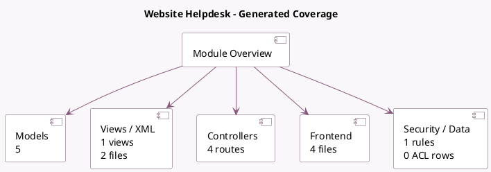

<!-- GENERATED:MODULE -->
---
tags: [odoo, enterprise, module]
---

# Website Helpdesk

- Scope: Enterprise Addons
- Source: enterprise/website_helpdesk
- Dependencies: [[docs/Enterprise Addons/helpdesk/helpdesk|helpdesk]], [[docs/Community Addons/website/website|website]]

## Summary

Bridge module for helpdesk modules using the website.

## Generated coverage

- Models: 5
- XML files with UI/data artifacts: 2
- Views: 1
- Actions: 0
- Menus: 0
- Rules (ir.rule): 1
- Access CSV entries: 0
- Controller units: 2
- Frontend asset files: 4

## Module map

## Detail notes

- Models: [[docs/Enterprise Addons/website_helpdesk/Models|Models]] (5)
- Views and XML: [[docs/Enterprise Addons/website_helpdesk/Views|Views]] (2 files)
- Controllers: [[docs/Enterprise Addons/website_helpdesk/Controllers|Controllers]] (2)
- Frontend: [[docs/Enterprise Addons/website_helpdesk/Frontend|Frontend]] (4 files)

## Key models

- `helpdesk.team`
- `helpdesk.ticket`
- `website`
- `website.menu`
- `website.page`

## Navigation

- [[../Enterprise Addons/Enterprise Addons|Back to scope]]
- [[../../docs/docs|Back to docs]]

<!-- GENERATED:MODULE -->

