<!-- GENERATED:MODEL -->
---
tags: [odoo, enterprise, generated, model]
---

# forum.post

- Module: [[docs/Enterprise Addons/website_helpdesk_forum/website_helpdesk_forum|website_helpdesk_forum]]
- Scope: Enterprise Addons
- Defined in module: extension only
- Source files: `models/forum_post.py`
- Python classes: `ForumPost`

## Field footprint

- Detected fields: 2
- Field types: `Boolean` x 1, `Many2one` x 1
- Relation fields: 1

## Sample fields

- `show_ticket`: `Boolean` (compute `_compute_show_ticket`)
- `ticket_id`: `Many2one` (comodel `helpdesk.ticket`)

## Method hints

- Detected methods: 3
- Action methods: none
- Compute methods: `_compute_show_ticket`
- Onchange methods: none

## Direct relation diagram

```plantuml
@startuml
!define ODOO_COLOR_PRIMARY #714B67
!define ODOO_COLOR_ACCENT #875A7B
!define ODOO_COLOR_BG #FAF7FA

skinparam backgroundColor ODOO_COLOR_BG
skinparam defaultTextAlignment left
skinparam ArrowColor ODOO_COLOR_ACCENT
skinparam ClassBackgroundColor white
skinparam ClassBorderColor ODOO_COLOR_PRIMARY
skinparam ComponentBackgroundColor white
skinparam ComponentBorderColor ODOO_COLOR_PRIMARY
skinparam NoteBackgroundColor #FFF8FF
skinparam NoteBorderColor ODOO_COLOR_ACCENT
skinparam SequenceLifeLineBorderColor ODOO_COLOR_ACCENT
skinparam SequenceLifeLineBackgroundColor #FFFFFF
skinparam SequenceParticipantBorderColor ODOO_COLOR_PRIMARY
skinparam SequenceParticipantBackgroundColor #FFFFFF
skinparam sequence {
  ArrowColor ODOO_COLOR_ACCENT
  ActorBorderColor ODOO_COLOR_PRIMARY
}
title forum.post - Direct Relations
class "forum.post" as forum_post
class "helpdesk.ticket" as helpdesk_ticket
forum_post --> helpdesk_ticket : ticket_id
@enduml
```

## Navigation

- **Parent:** [[docs/Enterprise Addons/website_helpdesk_forum/Models]]

<!-- GENERATED:MODEL -->
