<!-- GENERATED:MODEL -->
---
tags: [odoo, enterprise, generated, model]
---

# helpdesk.ticket

- Module: [[docs/Enterprise Addons/website_helpdesk_forum/website_helpdesk_forum|website_helpdesk_forum]]
- Scope: Enterprise Addons
- Defined in module: extension only
- Source files: `models/helpdesk.py`
- Python classes: `HelpdeskTicket`

## Field footprint

- Detected fields: 4
- Field types: `Boolean` x 2, `Integer` x 1, `Many2many` x 1
- Relation fields: 1

## Sample fields

- `can_share_forum`: `Boolean` (compute `_compute_can_share_forum`)
- `forum_post_count`: `Integer` (compute `_compute_forum_post_count`)
- `forum_post_ids`: `Many2many` (comodel `forum.post`)
- `use_website_helpdesk_forum`: `Boolean` (related `team_id.use_website_helpdesk_forum`)

## Method hints

- Detected methods: 4
- Action methods: `action_open_forum_posts`, `action_share_ticket_on_forum`
- Compute methods: `_compute_can_share_forum`, `_compute_forum_post_count`
- Onchange methods: none

## Direct relation diagram

```plantuml
@startuml
!define ODOO_COLOR_PRIMARY #714B67
!define ODOO_COLOR_ACCENT #875A7B
!define ODOO_COLOR_BG #FAF7FA

skinparam backgroundColor ODOO_COLOR_BG
skinparam defaultTextAlignment left
skinparam ArrowColor ODOO_COLOR_ACCENT
skinparam ClassBackgroundColor white
skinparam ClassBorderColor ODOO_COLOR_PRIMARY
skinparam ComponentBackgroundColor white
skinparam ComponentBorderColor ODOO_COLOR_PRIMARY
skinparam NoteBackgroundColor #FFF8FF
skinparam NoteBorderColor ODOO_COLOR_ACCENT
skinparam SequenceLifeLineBorderColor ODOO_COLOR_ACCENT
skinparam SequenceLifeLineBackgroundColor #FFFFFF
skinparam SequenceParticipantBorderColor ODOO_COLOR_PRIMARY
skinparam SequenceParticipantBackgroundColor #FFFFFF
skinparam sequence {
  ArrowColor ODOO_COLOR_ACCENT
  ActorBorderColor ODOO_COLOR_PRIMARY
}
title helpdesk.ticket - Direct Relations
class "helpdesk.ticket" as helpdesk_ticket
class "forum.post" as forum_post
helpdesk_ticket .. forum_post : forum_post_ids
@enduml
```

## Navigation

- **Parent:** [[docs/Enterprise Addons/website_helpdesk_forum/Models]]

<!-- GENERATED:MODEL -->
