<!-- GENERATED:MODEL -->
---
tags: [odoo, enterprise, generated, model]
---

# helpdesk.ticket.select.forum.wizard

- Module: [[docs/Enterprise Addons/website_helpdesk_forum/website_helpdesk_forum|website_helpdesk_forum]]
- Scope: Enterprise Addons
- Defined in module: yes
- Source files: `wizards/helpdesk_ticket_select_forum.py`
- Python classes: `HelpdeskTicketSelectForumWizard`
- Description: Share on Forum

## Field footprint

- Detected fields: 6
- Field types: `Char` x 1, `Html` x 2, `Many2many` x 1, `Many2one` x 2
- Relation fields: 3

## Sample fields

- `answer_content`: `Html`
- `description`: `Html` (compute `_compute_post`, store `True`)
- `forum_id`: `Many2one` (comodel `forum.forum`)
- `tag_ids`: `Many2many` (comodel `forum.tag`, compute `_compute_post`, store `True`)
- `ticket_id`: `Many2one` (comodel `helpdesk.ticket`)
- `title`: `Char` (compute `_compute_post`, store `True`)

## Method hints

- Detected methods: 6
- Action methods: `action_confirm_selection`, `action_create_post`, `action_create_view_post`
- Compute methods: `_compute_post`
- Onchange methods: none

## Direct relation diagram

```plantuml
@startuml
!define ODOO_COLOR_PRIMARY #714B67
!define ODOO_COLOR_ACCENT #875A7B
!define ODOO_COLOR_BG #FAF7FA

skinparam backgroundColor ODOO_COLOR_BG
skinparam defaultTextAlignment left
skinparam ArrowColor ODOO_COLOR_ACCENT
skinparam ClassBackgroundColor white
skinparam ClassBorderColor ODOO_COLOR_PRIMARY
skinparam ComponentBackgroundColor white
skinparam ComponentBorderColor ODOO_COLOR_PRIMARY
skinparam NoteBackgroundColor #FFF8FF
skinparam NoteBorderColor ODOO_COLOR_ACCENT
skinparam SequenceLifeLineBorderColor ODOO_COLOR_ACCENT
skinparam SequenceLifeLineBackgroundColor #FFFFFF
skinparam SequenceParticipantBorderColor ODOO_COLOR_PRIMARY
skinparam SequenceParticipantBackgroundColor #FFFFFF
skinparam sequence {
  ArrowColor ODOO_COLOR_ACCENT
  ActorBorderColor ODOO_COLOR_PRIMARY
}
title helpdesk.ticket.select.forum.wizard - Direct Relations
class "helpdesk.ticket.select.forum.wizard" as helpdesk_ticket_select_forum_wizard
class "forum.forum" as forum_forum
class "forum.tag" as forum_tag
class "helpdesk.ticket" as helpdesk_ticket
helpdesk_ticket_select_forum_wizard --> helpdesk_ticket : ticket_id
helpdesk_ticket_select_forum_wizard --> forum_forum : forum_id
helpdesk_ticket_select_forum_wizard .. forum_tag : tag_ids
@enduml
```

## Navigation

- **Parent:** [[docs/Enterprise Addons/website_helpdesk_forum/Models]]

<!-- GENERATED:MODEL -->
